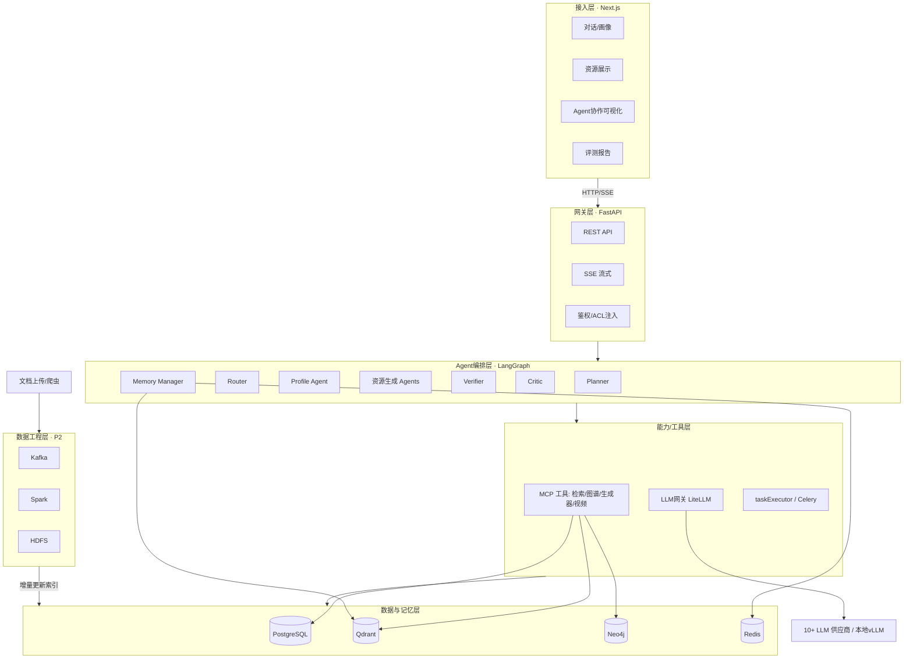
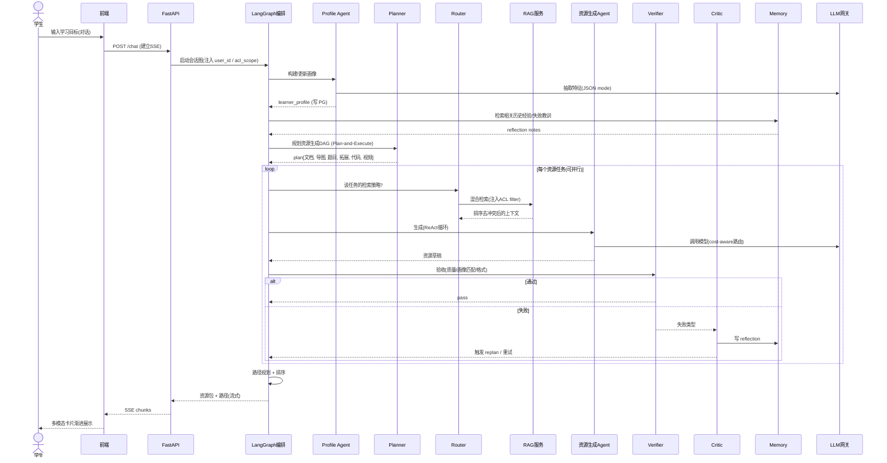
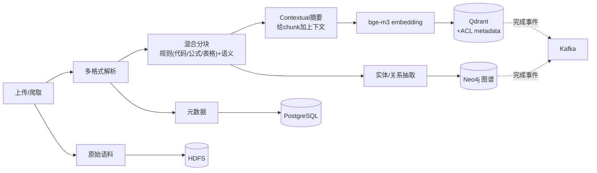
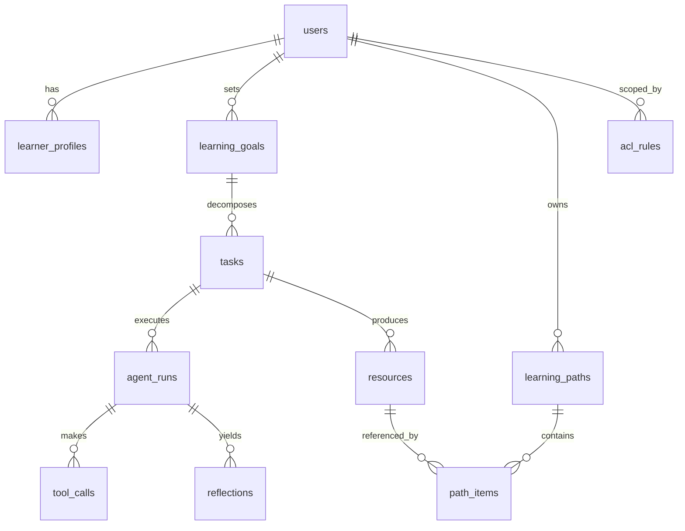

# 01 · 系统架构与数据流详细设计

更新时间：2026-06-01
关联：00-项目蓝图与里程碑。本文定骨架，组件内部细节由 02–07 展开。

---

## 1. 架构总览

设计原则（呼应「核心开发并行度 = 1」）：

1. **分层解耦**：每层只通过明确接口对话，换实现不影响上下游。
2. **主链路与增强链路物理隔离**：对话→生成的主链路同步、低延迟；大数据增量、微调走异步，不阻塞主链路。
3. **无状态服务 + 集中状态**：服务可随时重启，状态集中在 Postgres / Redis，便于单人调试和水平扩展。



### 1.1 两个横切设计：Skills-Agent 两层 + Harness 治理面

上图「Agent 编排层 ↔ 能力/工具层」之间，贯穿两个架构级约定（详细设计见 02）：

**① Skills-Agent 两层 —— 决策与执行分离**

- **Agent 层只做决策**：规划、路由、验收、反思——决定「做什么、调哪个能力、是否通过」。
- **Skill 层是原子能力**：检索、画像抽取、文档/题目/导图/代码/视频生成、路径规划、质量校验——每个 Skill 是输入输出契约清晰的纯能力单元，自带「调用限次 + 结果缓存 + 调用监控」。
- 价值：能力可复用、可独立测试、可热插拔（新增能力 = 新增一个 Skill，不动编排逻辑）；对「1 人 + AI」开发极友好。Skill 对外经 MCP 暴露（见 05）。
- 因此 1 节架构图里的「资源生成 Agents」实质是 **Agent（决策）+ 一组 Skill（执行）** 的组合，而非把生成逻辑写死在 Agent 内部。

**② Harness 治理面 —— 横切所有 Agent 的运行护栏**

不是某一层，而是包住整个编排层的治理逻辑（借鉴 Claude Code / harness）：

- **约束三层校验**：前置（输入合法？目标够明确？）→ 中间（检索空？超 token/迭代预算？工具不可用？）→ 后置（知识准确？匹配画像？格式完整？无隐私泄露？）。
- **失败分层兜底**：Skill 级重试 → Agent 级 replan → 冲突升级 → 系统级降级，逐级上抛。
- **熵管理 + 循环控制**：迭代上限、循环检测、token 预算、终止条件，防止状态爆炸与成本失控。

这两条是「为什么本项目不是一条工作流，而是可治理的自主智能体系统」的核心论据。

## 2. 运行时组件清单（docker-compose 服务）

| 服务 | 技术 | 端口 | 职责 | 依赖 |
|---|---|---|---|---|
| frontend | Next.js | 3000 | UI、SSE 渲染 | api |
| api | FastAPI + uvicorn | 8000 | REST / SSE、编排入口、ACL 注入 | pg, redis, qdrant, neo4j, llm-gateway |
| worker | Celery | — | 异步重任务（视频、批清洗） | redis, kafka |
| llm-gateway | LiteLLM | 4000 | 多供应商路由 + 回退 + 计费 | — |
| vllm | vLLM | 8001 | 本地模型 / 微调模型推理 | GPU |
| postgres | postgres:16 | 5432 | 关系数据 | — |
| qdrant | qdrant | 6333 | 向量库 | — |
| neo4j | neo4j:5 | 7474 / 7687 | 知识图谱 | — |
| redis | redis:7 | 6379 | 缓存 / 短期状态 / broker | — |
| kafka | bitnami/kafka | 9092 | 增量更新事件流 | — |
| spark | bitnami/spark | 8080 | 批处理清洗 | hdfs |
| hdfs | namenode + datanode | 9870 | 原始语料数据湖 | — |
| observability | Prometheus + Grafana | 9090 / 3001 | health metrics 看板 | — |

> 开发期可用 `profiles` 分组：`core`（api/pg/redis/qdrant/neo4j/llm-gateway）日常起；`bigdata`（kafka/spark/hdfs）按需起，避免单机常驻吃资源。

## 3. 核心端到端时序：学习目标 → 资源包



## 4. 关键子链路

### 4.1 文档上传 → 知识入库（写链路）



### 4.2 混合检索（读链路）

`Router 判类型` → 并行（Qdrant 语义 / Neo4j 图扩展 / 关键词 BM25）→ 合并 → `bge-reranker 重排` → **ACL 物理过滤（查询层 filter，非提示词拦截）** → 冲突检测（来源 / 时效 / 定义范围）→ 上下文组装（token 预算内）。细节见 03 文档。

### 4.3 Reflexion 失败学习

`Verifier 标记失败类型` → `Critic 归因（失败类型 + 原因 + 修复策略）` → 生成 reflection note → 写入 Qdrant `experience_memory`（带 metadata）→ 下次同类任务 Planner 执行前检索 → 调整计划 / 工具 / prompt。细节见 03 文档。

### 4.4 增量更新（P2）

`Kafka 事件(文档变更)` → Spark / worker 消费 → 重新清洗 / 分块 / 向量化 / 更新图谱 → 索引热更新 → 失效相关 Redis 缓存。细节见 04 文档。

## 5. 数据模型总览

### 5.1 PostgreSQL（核心表关系）



关键字段：

- `users`(id, role, tenant_id)
- `learner_profiles`(user_id, dimensions **JSONB**[知识基础/认知风格/目标/薄弱点/偏好/进度… ≥6 维], version, updated_at)
- `profile_history`(快照，支持「随学随新」可追溯)
- `learning_goals`(user_id, course, goal_text, status)
- `tasks`(goal_id, type, status, plan JSONB, iteration_count, token_used)
- `agent_runs`(task_id, agent_name, io 摘要, latency, status, trace_id)
- `tool_calls`(run_id, tool, params JSONB, result, duration, error_type)
- `resources`(task_id, type[doc/mindmap/quiz/reading/video/code], content, meta JSONB, quality_score)
- `learning_paths` / `path_items`(顺序, 资源引用, 掌握状态)
- `reflections`(run_id, failure_type, cause, fix_strategy, embedded_id)
- `acl_rules`(user_id, tenant_id, course_id, visibility)
- `eval_runs`(strategy, scores JSONB, created_at)

### 5.2 Qdrant collections

- `knowledge_chunks`：vector(bge-m3, 1024) + payload{doc_id, chunk_id, **user_id, tenant_id, course_id, visibility**, source, source_trust, published_at, content, context_summary}
- `experience_memory`：vector + payload{task_type, failure_type, cause, fix_strategy, success, created_at, user_scope}
- 检索时**强制 filter**：visibility / tenant / course → 物理隔离。

### 5.3 Neo4j 图模型

- 节点：`Concept`(知识点)、`Resource`、`Document`、`Skill`、`Misconception`(易错点)
- 关系：`(Concept)-[:PREREQUISITE_OF]->(Concept)`、`(Resource)-[:COVERS]->(Concept)`、`(Concept)-[:RELATED_TO]->(Concept)`、`(Quiz)-[:TESTS]->(Concept)`、`(Misconception)-[:OF]->(Concept)`
- 用途：路径规划（前置依赖拓扑序）、概念扩展检索、画像薄弱点关联。

### 5.4 Redis key

- `session:{sid}` 会话状态 / 短期记忆
- `cache:qa:{hash}` 热点问答 TTL 缓存
- `task:{tid}:status` 任务进度（SSE 推送源）
- `profile:{uid}:summary` 画像摘要
- `ratelimit:{provider}` 供应商限流
- Celery broker / result backend

## 6. 前端信息架构（概要）

| 路由 | 页面 | 要点 |
|---|---|---|
| `/` | 对话主页 | 画像构建 + 资源生成入口，SSE 流式 |
| `/profile` | 画像可视化 | 雷达图 + 可解释推荐（为什么推这个） |
| `/path` | 学习路径 | 知识点依赖图 + 进度 |
| `/resources/[id]` | 资源详情 | 多模态卡片（文档/导图/题/视频/代码） |
| `/agents` | Agent 协作时间线 | **可视化加分点** |
| `/eval` | 评测报告看板 | 消融对比 |
| `/library` | 文档与知识库管理 | 上传、ACL |

SSE 事件分类型：`token` / `resource_card` / `agent_step` / `done`，前端按类型渐进渲染。

## 7. 模块接口契约总览（单人开发的关键）

> 接口先定、实现后填。下面是 Python 层关键边界接口（签名级），各模块文档（02–07）负责细化实现。**先冻结这些接口，AI 就能并行、低上下文地实现各模块。**

```python
# 关键接口契约（节选）

class Orchestrator(Protocol):
    async def run_session(self, user_id: str, message: str,
                          acl: ACLScope) -> AsyncIterator[Event]: ...
    # LangGraph 状态机入口，产出流式事件

class LLMGateway(Protocol):
    async def complete(self, messages: list[Msg], *, task_type: TaskType,
                       schema: type[BaseModel] | None = None) -> Completion: ...
    # 内部: cost-aware 路由 + HTTP 回退链 + 重试/熔断/计费

class RAGService(Protocol):
    async def retrieve(self, query: str, *, acl: ACLScope,
                       strategy: RetrievalStrategy) -> RetrievalResult: ...
    # 内部: 混合检索 + rerank + ACL物理过滤 + 冲突检测

class MemoryManager(Protocol):
    async def recall(self, task_type: str, query: str, *, acl: ACLScope) -> list[Reflection]: ...
    async def write_reflection(self, r: Reflection) -> None: ...

class MCPToolRegistry(Protocol):
    def list_tools(self) -> list[ToolSpec]: ...
    async def call(self, tool: str, params: dict) -> ToolResult: ...

class Verifier(Protocol):
    async def verify(self, resource: Resource, profile: Profile,
                     spec: ResourceSpec) -> VerifyResult: ...
```

## 8. 与后续文档的衔接

| 后续文档 | 细化本文的哪部分 |
|---|---|
| 02 Agent 编排 | Orchestrator、状态 schema、各 Agent、PaE/ReAct、**Skills-Agent 两层、Harness 治理面** |
| 03 记忆与 RAG | RAGService、MemoryManager 内部 |
| 04 数据工程 | 写链路 4.1、增量 4.4 |
| 05 网关与工具 | LLMGateway、MCPToolRegistry、taskExecutor |
| 06 评测可观测 | trace_id 贯穿、eval_runs |
| 07 工程化 | 组件清单 → 目录结构 + docker-compose |
