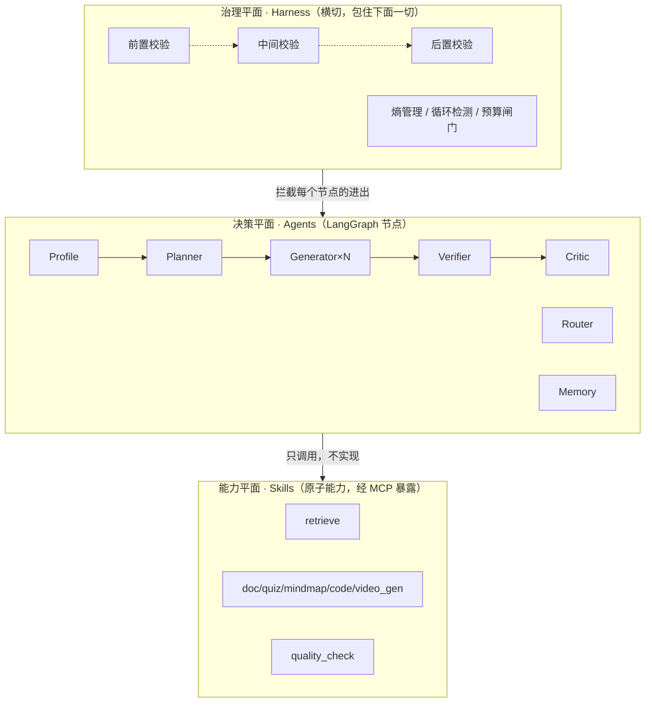

# 02 · Agent 编排层详细设计（核心）

更新时间：2026-06-01
关联：00 蓝图、01 架构（第 1.1 节横切设计、第 7 节接口契约）。本文是「打开编辑器照着写」的粒度。

> 本文是项目技术深度的承重墙。读者读完应能直接搭出 LangGraph 状态机骨架、定义全部 State / IO schema、实现 Skill 基类与 Harness 中间件。实现细节中标 `# 骨架` 的代码块为设计契约，编码时填充实现，但 **API 用法是正确可运行的**。

---

## 0. 一句话定位

> 这不是一条 LLM 工作流，而是一个**可治理的自主智能体系统**：Agent 负责决策、Skill 负责执行、Harness 负责约束，三者在 LangGraph 状态机上协同，靠推理循环 + 记忆 + 反思自主调整策略，并有明确的终止条件与成本上限。

---

## 1. 编排层全景：三个平面

把编排层切成三个正交平面，分别回答三个问题。这是后面所有设计的总纲。

| 平面 | 回答的问题 | 组成 | 对应文档节 |
|---|---|---|---|
| **决策平面 Agents** | 做什么？调哪个能力？通过没？ | Profile / Planner / Router / Generator / Verifier / Critic / Memory | §3 §5 §6 |
| **能力平面 Skills** | 怎么执行一个原子动作？ | 检索器 / 各类生成器 / 校验器（带限次·缓存·监控） | §4 |
| **治理平面 Harness** | 怎么不跑偏、不超支、不出错？ | 约束三层校验 / 失败四级兜底 / 熵管理 / 循环·迭代·token 控制 | §7 |



**关键区分**：01 架构图里的「资源生成 Agents」= 一个 **Generator Agent（决策：怎么生成、是否重试）** + 一组 **Skill（执行：真正产出内容）**。生成逻辑不写死在 Agent 里。

---

## 2. 状态 Schema —— 一切的中枢

LangGraph 的灵魂是 State。**State 设计的好坏直接决定上下文是否膨胀、是否可恢复、能否并行。** 三条铁律：

1. **严格最小**：只存「跨节点必须共享」的核心变量，大块内容（原始检索片段、长草稿）落 Redis/PG，State 里只放引用 id 和摘要。
2. **带 reducer**：并行节点写同一字段时，必须用 `Annotated[T, reducer]`，否则 LangGraph 抛 `InvalidUpdateError`。
3. **可序列化**：所有字段能被 checkpointer 持久化（用于断点恢复 + human-in-the-loop）。

```python
# 骨架：orchestration/state.py
from typing import Annotated, TypedDict, Literal, Optional
from operator import add
from langgraph.graph.message import add_messages

ResourceType = Literal["doc", "mindmap", "quiz", "reading", "code", "video"]

class ResourceTask(TypedDict):
    task_id: str
    type: ResourceType
    spec: dict                # ResourceSpec.model_dump()，受画像约束
    status: Literal["pending", "running", "passed", "failed"]
    attempts: int
    result_ref: Optional[str] # 大内容存 PG/Redis，这里只放引用

class AgentState(TypedDict):
    # —— 身份与会话（只读贯穿，ACL 物理过滤的源头）——
    user_id: str
    acl: dict                                    # ACLScope.model_dump()
    messages: Annotated[list, add_messages]      # 短期对话，自带 reducer

    # —— 画像与目标 ——
    learner_profile: dict                        # LearnerProfile
    learning_goal: str

    # —— 规划与执行（Plan-and-Execute 中枢）——
    plan: list[ResourceTask]                     # Planner 产出的子任务 DAG
    completed: Annotated[list[dict], add]        # ★并行 Generator 结果汇聚，reducer 累加

    # —— 记忆（执行前注入的历史教训）——
    reflections: list[dict]

    # —— Harness 控制位（治理平面读写）——
    iteration: int                               # 全局 super-step 计数
    replan_count: int
    token_used: int
    halt_reason: Optional[str]                   # 非空 = 触发终止

    # —— 最终产出 ——
    resource_bundle: Optional[dict]
    learning_path: Optional[list[dict]]
```

字段分组与裁剪理由：

| 分组 | 为什么进 State | 为什么不放更多 |
|---|---|---|
| 身份/ACL | 每个检索/生成节点都要用它做物理过滤 | — |
| messages | 短期记忆，ReAct 循环要看历史 | 用 `add_messages` + 03 的 TrimStrategy 控长度，不无限堆 |
| plan/completed | PaE 的计划与回收，必须全局可见 | `result_ref` 只存引用，正文落库 |
| Harness 控制位 | 终止条件、预算闸门要随时可判 | 4 个标量，极轻 |

> 这一节直接兑现需求里的「StateSchema 定义严格的状态结构、用 TypedDict 只保存核心变量」。

---

## 3. Agent 角色规格

7 个角色，每个给出：职责、推理范式、输入、输出（Pydantic 契约）、调用的 Skill。

| Agent | 职责（一句话） | 范式 | 关键产出 |
|---|---|---|---|
| **Profile** | 抽取/更新学习者画像 | 单步 JSON | `LearnerProfile` |
| **Planner** | 把学习目标拆成资源子任务 DAG | Plan-and-Execute | `list[ResourceTask]` |
| **Router** | 判定每个子任务的检索/生成策略 | 单步分类 | `RetrievalStrategy` |
| **Generator** | 生成单个资源（可重试） | ReAct | `ResourceDraft` |
| **Verifier** | 三层后置校验资源 | 规则+LLM judge | `VerifyResult` |
| **Critic** | 失败归因、产出反思、决定 replan | 反思 | `Reflection` |
| **Memory** | 召回历史经验、写入反思、压缩摘要 | 检索/写 | `list[Reflection]` |

核心 IO 契约（Pydantic，编码时直接用作 LLM 的 `response_format`）：

```python
# 骨架：orchestration/schemas.py
from pydantic import BaseModel, Field
from typing import Literal

class LearnerProfile(BaseModel):
    knowledge_base: dict[str, float] = Field(description="知识点->掌握度 0~1")
    cognitive_style: Literal["visual", "verbal", "active", "reflective"]
    goal: str
    weak_points: list[str]
    preferences: dict
    progress: float

class ResourceSpec(BaseModel):
    type: Literal["doc", "mindmap", "quiz", "reading", "code", "video"]
    concept_ids: list[str]
    difficulty: float = Field(ge=0, le=1, description="受画像掌握度约束")
    style_hint: str          # 由 cognitive_style 推导
    constraints: list[str]   # 如「必须含可运行代码」「不超过 800 字」

class VerifyResult(BaseModel):
    passed: bool
    layer_failed: Literal["none", "format", "profile_match", "knowledge"] = "none"
    score: float = Field(ge=0, le=1)
    issues: list[str]
    fixable: bool            # True->可自修复重试；False->必须 replan

class Reflection(BaseModel):
    task_type: str
    failure_type: str
    cause: str
    fix_strategy: str        # 下次同类任务执行前注入
    success: bool
```

> **Profile Agent 体现「随学随新」**：每次会话后写 `profile_history` 快照（见 01 §5.1），画像是动态演进而非一次性。

---

## 4. Skills 原子能力层

### 4.1 为什么要这一层（对单人开发的价值）

- 每个 Skill 是「输入 schema → 输出 schema」的纯函数式能力，**可独立写、独立测、独立 mock**——AI 协作开发时上下文极小。
- 自带**限次 + 缓存 + 监控**三件套，是成本与可观测性的最小闭环。
- 对外经 MCP 暴露（见 05），换 Agent 框架也能复用。

### 4.2 Skill 基类接口

```python
# 骨架：skills/base.py
from pydantic import BaseModel
from typing import Protocol, Optional

class SkillContext(BaseModel):
    user_id: str
    acl: dict
    task_id: str
    trace_id: str            # 贯穿 06 可观测

class SkillResult(BaseModel):
    ok: bool
    data: Optional[dict]
    error_type: Optional[str]
    duration_ms: int
    cached: bool = False

class Skill(Protocol):
    name: str
    max_calls_per_task: int          # ★限次：单任务内调用上限，超出由 Harness 拦截
    cache_ttl: Optional[int]         # ★缓存：None=不缓存；命中走 Redis cache:skill:{hash}
    input_model: type[BaseModel]
    output_model: type[BaseModel]

    async def run(self, inp: BaseModel, ctx: SkillContext) -> SkillResult: ...
    # 实现内部统一：参数校验 -> 缓存查 -> 执行(含重试) -> 监控埋点 -> 缓存写
```

### 4.3 Skill 清单（ML 学习场景）

| Skill | 类别 | 输入 | 输出 | 限次 | 缓存 |
|---|---|---|---|---|---|
| `retrieve` | 检索器 | query+strategy+acl | 排序去冲突上下文 | 6 | 5min |
| `graph_query` | 检索器 | concept_ids | 前置依赖/相关概念 | 4 | 30min |
| `doc_gen` | 生成器 | ResourceSpec+context | 讲解文档 | 3 | — |
| `quiz_gen` | 生成器 | ResourceSpec+context | 带解析题目 | 3 | — |
| `mindmap_gen` | 生成器 | concept_ids+context | 思维导图(JSON/mermaid) | 2 | — |
| `code_gen` | 生成器 | ResourceSpec | 可运行 ML 代码案例 | 3 | — |
| `video_gen` | 生成器 | script | 讲解视频(异步 Celery) | 1 | — |
| `quality_check` | 校验器 | resource+spec+profile | VerifyResult | 4 | — |
| `path_plan` | 规划器 | resources+graph | 学习路径(拓扑序) | 2 | — |

> 限次是**每任务**维度，由 Harness 计数拦截（§7.4），防止 ReAct 循环里某个 Skill 被反复无效调用而成本失控。

---

## 5. 推理范式落地：PaE 宏观 + ReAct 微观

呼应方向设计文档 §6 的混合范式判断，这里给**落到 LangGraph 的实现**。

### 5.1 谁是 PaE，谁是 ReAct

| 层级 | 范式 | LangGraph 形态 |
|---|---|---|
| 宏观：目标→子任务 DAG | **Plan-and-Execute** | `planner` 节点一次性产出 `plan`，`fan_out` 用 `Send` 并行分发 |
| 微观：单个资源生成 | **ReAct** | `generate_resource` 节点内部 Thought→Action(调Skill)→Observation 循环（≤ k 次） |
| 异常：计划失效 | **Replan** | `gate`→`critic`→`planner` 的回边 |

### 5.2 Generator 内部的 ReAct 循环（骨架）

```python
# 骨架：orchestration/nodes/generator.py
async def generate_resource(state: AgentState) -> dict:
    task = state["_current_task"]          # 由 Send 注入
    spec = ResourceSpec(**task["spec"])
    for step in range(MAX_REACT_STEPS):    # 微观迭代上限
        # Thought: 决定下一步动作（缺上下文?直接生成?）
        action = await reason_next_action(state, spec)
        # Action: 调 Skill（生成 / 补检索）
        obs = await SKILLS[action.skill].run(action.inp, ctx)
        if not obs.ok:                      # Skill 级失败 -> 本循环内换策略
            continue
        # 后置自校验（Harness 后置层的一部分）
        vr = await SKILLS["quality_check"].run(...)
        if vr.data["passed"]:
            return {"completed": [{"task_id": task["task_id"], "status": "passed",
                                   "result_ref": save_draft(obs.data)}]}
        if not vr.data["fixable"]:          # 不可修复 -> 上抛给 gate 做 replan 裁决
            break
        # 可修复 -> 带着 issues 进入下一轮 ReAct（自修复）
    return {"completed": [{"task_id": task["task_id"], "status": "failed"}]}
```

### 5.3 replan 触发条件（写进 `gate` 路由）

`Verifier 连续失败` / `检索结果为空` / `不可修复失败` / `子任务相互依赖冲突` → 回 `planner` 重规划（受 `replan_count` 上限约束），而非在原计划里硬撑。

---

## 6. 多 Agent 协作模式

不止一种，由 Planner 按任务类型选择；三种模式都在同一张 StateGraph 上用不同子图表达。

| 模式 | 适用 | LangGraph 实现 | 收敛控制 |
|---|---|---|---|
| **中心化（Orchestrator-Worker）** | 资源包生成（默认） | Planner 拆任务 → `Send` 扇出 Generator → `gate` 汇聚验收 | replan 上限 + 预算闸门 |
| **流水线（Pipeline）** | 文档→大纲→题目这种强依赖链 | 顺序 `add_edge`，上游输出入下游 spec | 每段后置校验，失败回退一格 |
| **民主辩论（Debate）** | 知识点有争议/检索片段冲突 | 多个 `debater` 子图并行 → `judge` 节点裁决 | 固定 N 轮上限 + judge 终裁，杜绝无限对辩 |

```python
# 骨架：Planner 选择协作模式
def choose_collab_mode(goal_type: str) -> Literal["central", "pipeline", "debate"]:
    if goal_type == "resource_bundle": return "central"
    if goal_type == "structured_chain": return "pipeline"
    if goal_type == "controversial":    return "debate"
```

> 辩论模式直接解决需求里的「无限循环 / 通信冗余」：**固定轮次上限 + 单一 judge 终裁 + 每轮对话摘要化**（不传全文，传立场摘要），三者叠加保证收敛。

---

## 7. Harness 治理层（横切，项目的「自主而不失控」论据）

借鉴 Claude Code / harness：把治理从 Agent 业务逻辑里**剥离成独立面**，用中间件/装饰器包住每个节点的进出。

### 7.1 约束三层校验（具体检查点）

| 层 | 时机 | 检查点（ML 学习场景） | 不通过动作 |
|---|---|---|---|
| **前置** | 节点执行前 | 目标够明确？画像非空？ACL 合法？参数 schema 合规？ | 反问用户 / 补默认 / 拒绝 |
| **中间** | 执行中 | 检索是否为空？token/迭代是否超预算？Skill 是否超限次？工具是否可用？ | 降级 / 回退链 / 触发 replan |
| **后置** | 节点产出后 | 知识准确（judge 打分）？匹配画像难度/风格？格式完整？**无隐私泄露**？ | 自修复重试 / replan / 拦截 |

### 7.2 失败四级兜底

```text
L1 Skill 级   : run() 内重试/换参 (retry, timeout, fallback)
L2 Agent 级   : Generator ReAct 循环内换策略 (≤ k 次)
L3 编排级     : gate -> critic -> planner replan (≤ replan_count)
L4 系统级     : 降级返回「已完成部分 + 失败说明」，绝不假装成功
```

### 7.3 熵管理（把抽象概念落成 4 个具体机制）

| 机制 | 落地手段 |
|---|---|
| **输出熵控制** | 结构化决策节点（Planner/Router/Verifier）`temperature≈0` + JSON mode；创意生成节点才适度调高 |
| **不确定性度量与升级** | 低置信信号（self-评分低 / 多次采样不一致 / 检索命中分低）→ 升级强模型 / 人工确认(`interrupt`) / replan |
| **上下文熵控制** | State 严格裁剪（§2）+ 递归摘要（03 SummaryBuffer），防上下文膨胀稀释注意力 |
| **过程熵控制** | 状态指纹去重 + 重复工具调用检测，连续重复→判不收敛→halt |

### 7.4 循环·迭代·token 控制与终止条件

```python
# 骨架：orchestration/harness.py —— 包在每个节点外的中间件
async def harness_guard(node_fn, state: AgentState) -> dict:
    # 1) 迭代闸门
    if state["iteration"] >= MAX_ITERATIONS:
        return {"halt_reason": "max_iterations"}
    # 2) token 预算闸门
    if state["token_used"] >= TOKEN_BUDGET:
        return {"halt_reason": "token_budget"}
    # 3) 循环检测（状态指纹）
    fp = fingerprint(state)
    if loop_detector.seen_consecutively(fp, n=3):
        return {"halt_reason": "loop_detected"}
    # 4) 前置校验
    pre = precheck(state)
    if not pre.ok:
        return handle_precheck_fail(pre)     # interrupt / 补默认 / 拒绝
    # —— 真正执行节点 ——
    out = await node_fn(state)
    out["iteration"] = state["iteration"] + 1
    return out
```

**明确的终止条件**（满足任一即结束）：

1. `plan` 中全部 `ResourceTask.status == "passed"` → 正常收尾（assemble）。
2. `halt_reason` 被置位（超迭代 / 超 token / 循环 / 不可恢复）→ 降级收尾（L4）。
3. `replan_count > MAX_REPLAN` → 带部分结果终止。
4. LangGraph `recursion_limit` 兜底（compile 时设，防极端情况）。

---

## 8. LangGraph 图构建（拼装骨架）

```python
# 骨架：orchestration/graph.py
from langgraph.graph import StateGraph, START, END
from langgraph.types import Send
from langgraph.checkpoint.postgres import PostgresSaver   # 断点恢复 + HITL

def build_graph(skills, checkpointer):
    g = StateGraph(AgentState)

    # 节点（每个都被 harness_guard 包裹）
    g.add_node("profile",  guarded(profile_node))
    g.add_node("recall",   guarded(recall_memory_node))
    g.add_node("planner",  guarded(planner_node))
    g.add_node("generate_resource", guarded(generate_resource))  # ReAct
    g.add_node("gate",     guarded(gate_node))                    # 全局裁决
    g.add_node("critic",   guarded(critic_node))
    g.add_node("assemble", guarded(assemble_node))
    g.add_node("path_plan", guarded(path_plan_node))

    # 主链路
    g.add_edge(START, "profile")
    g.add_edge("profile", "recall")
    g.add_edge("recall", "planner")

    # ★ PaE 并行扇出：Planner -> N 个 Generator（Send 动态 map）
    def fan_out(state: AgentState):
        return [Send("generate_resource", {**state, "_current_task": t})
                for t in state["plan"] if t["status"] == "pending"]
    g.add_conditional_edges("planner", fan_out, ["generate_resource"])

    # 所有 Generator 分支汇聚到 gate（barrier）
    g.add_edge("generate_resource", "gate")

    # ★ gate 条件路由：收尾 / replan / 降级
    def gate_route(state: AgentState):
        if state.get("halt_reason"):                 return "assemble"      # L4 降级收尾
        if all(t["status"] == "passed" for t in state["plan"]): return "assemble"
        if state["replan_count"] < MAX_REPLAN:       return "critic"        # 去 replan
        return "assemble"                            # 部分结果收尾
    g.add_conditional_edges("gate", gate_route, ["critic", "assemble"])

    g.add_edge("critic", "planner")                  # replan 回边
    g.add_edge("assemble", "path_plan")
    g.add_edge("path_plan", END)

    return g.compile(checkpointer=checkpointer)

# 调用：recursion_limit 兜底
# graph.astream(input, config={"recursion_limit": 50,
#                              "configurable": {"thread_id": session_id}})
```

要点：

- `Send` 实现真正的 map-reduce 并行扇出，`completed` 的 `add` reducer 自动汇聚多分支结果——这是 §2 铁律 2 的落点。
- `PostgresSaver` checkpointer 让会话可断点恢复，也是 `interrupt`（高风险人工确认）的前提。
- `critic→planner` 回边 + `replan_count` 上限 = 自主纠错但不死循环。

---

## 9. 关键接口契约（汇总，冻结后可并行开发）

```python
class Orchestrator(Protocol):
    async def run_session(self, user_id, message, acl) -> AsyncIterator[Event]: ...

class Skill(Protocol):              # §4.2
    async def run(self, inp, ctx) -> SkillResult: ...

class HarnessMiddleware(Protocol):  # §7.4
    async def guard(self, node_fn, state) -> dict: ...
```

依赖关系：`Orchestrator` 依赖 `LLMGateway`(05) / `RAGService`(03) / `MemoryManager`(03) / `MCPToolRegistry`(05)。**这些接口冻结后，6 个模块可由 AI 并行、低上下文地实现。**

---

## 10. 落地顺序（对齐 00 里程碑 M1）

1. 先定 `state.py` + `schemas.py`（接口冻结）。
2. 跑通最小图：`profile → planner → 单个 generate_resource → gate → assemble → END`（先串行、单资源、mock Skill）。
3. 接真 Skill（doc_gen / quiz_gen + retrieve）。
4. 加 `Send` 并行扇出 + `completed` 汇聚。
5. 加 Harness 中间件（迭代/token/循环闸门 + 三层校验）。
6. 加 critic replan 回边 + Reflexion 写入（衔接 03）。
7. 加协作模式选择（debate 留到 P1）。

| 后续文档 | 本文留给它的接口 |
|---|---|
| 03 记忆与 RAG | `recall_memory_node` / `retrieve` Skill / Reflexion 写入 |
| 05 网关与工具 | Skill 经 MCP 暴露、Generator 调 LLMGateway 的 cost-aware 路由 |
| 06 评测可观测 | `trace_id` 贯穿、各节点 latency/token 埋点 |
