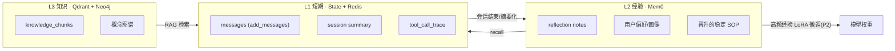
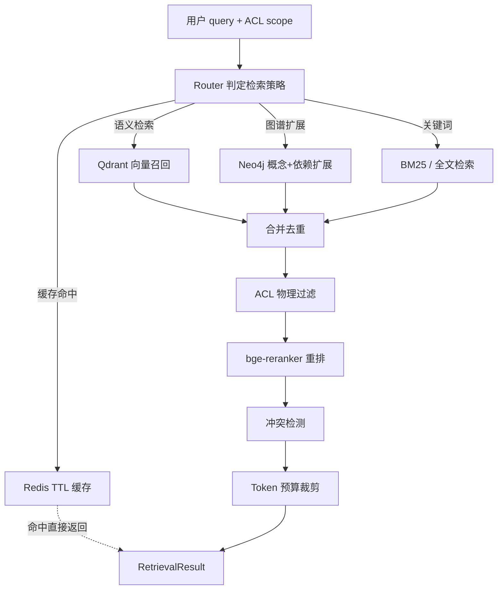
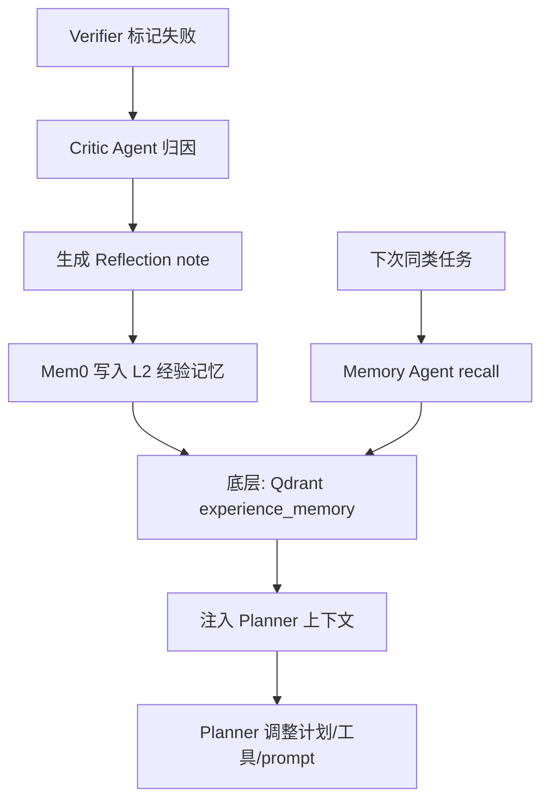

# 03 · 记忆与 RAG 详细设计

更新时间：2026-06-02
关联：00 蓝图（§3 P1 记忆/RAG）、01 架构（§4 子链路）、02 编排（§2 State / §3 Memory Agent / §4 retrieve Skill）。

> 本文回答三个问题：Agent 怎么「记住」（记忆分层）、怎么「找到」（混合检索）、怎么「不犯同样的错」（Reflexion 闭环）。读完应能直接实现 MemoryManager、RAGService、TrimStrategy 三大组件。

---

## 0. 一句话定位

> 记忆不是"把历史塞进 context"，而是**按时效 × 价值分级管理**——短期靠 State + Redis 保持连贯，中期靠 Mem0 沉淀经验，长期靠 Qdrant + Neo4j 提供知识底座，并通过递归摘要控制上下文熵、通过 Reflexion 把失败转为可检索的策略。

---

## 1. 三级记忆架构

### 1.1 总览

| 级别 | 名称 | 内容 | 存储 | 生命周期 | 写入时机 | 读取时机 |
|---|---|---|---|---|---|---|
| **L1** | 短期记忆 | 当前会话对话、工具调用、中间结果 | LangGraph State (`messages`) + Redis `session:{sid}` | 会话内 | 每轮自动 | 每个节点执行时 |
| **L2** | 经验记忆 | 跨会话的用户偏好、任务反思、有效策略 | **Mem0**（底层 Qdrant `experience_memory`） | 跨会话持久 | Reflexion 写入 / 画像更新 / 高频 SOP 晋升 | Planner 执行前 recall |
| **L3** | 知识记忆 | 文档知识、课程内容、知识图谱 | Qdrant `knowledge_chunks` + Neo4j + PostgreSQL | 持久 | 数据工程写链路（04） | RAG 检索 |



### 1.2 为什么用 Mem0 而不是直接写 Qdrant

直接写 Qdrant 只能做"存向量 + 查向量"，但经验记忆需要：

1. **记忆抽取**：从对话中提取值得长期保存的信息（不是全存）。
2. **更新合并**：同一用户的偏好变化了，要更新而非追加。
3. **去重**：相似经验不应重复存储。
4. **语义召回 + 元数据过滤**：按 task_type / user_id / 时间范围组合查询。

Mem0 是记忆管理层，Qdrant 是它的向量底座。两者关系：Mem0 负责「记什么、怎么更新、怎么合并」，Qdrant 负责「存和查」。

### 1.3 L1 → L2 记忆晋升机制

不是所有短期记忆都值得沉淀。晋升条件：

| 来源 | 晋升条件 | 写入 L2 的内容 |
|---|---|---|
| Reflexion | Critic 产出反思 | `Reflection(task_type, failure_type, cause, fix_strategy)` |
| 画像更新 | Profile Agent 检测到维度变化 | 画像差分快照 |
| 有效策略 | 同一策略连续 N 次成功 | SOP 摘要（从反思中归纳） |
| 用户显式反馈 | 用户点赞/踩/纠正 | 偏好记录 |

```python
# 骨架：memory/promotion.py
async def maybe_promote(session_result: SessionResult, mem0_client):
    # 1) Reflexion 产出的反思 -> 直接写 L2
    for r in session_result.reflections:
        await mem0_client.add(
            messages=[{"role": "assistant", "content": r.model_dump_json()}],
            user_id=session_result.user_id,
            metadata={"type": "reflection", "task_type": r.task_type,
                       "failure_type": r.failure_type}
        )
    # 2) 画像变化 -> 写 L2
    if session_result.profile_changed:
        await mem0_client.add(
            messages=[{"role": "system", "content": f"画像更新: {session_result.profile_diff}"}],
            user_id=session_result.user_id,
            metadata={"type": "profile_update"}
        )
    # 3) SOP 晋升 -> 连续 3 次同策略成功
    await check_sop_promotion(session_result, mem0_client)
```

---

## 2. 上下文工程（L1 深入）

### 2.1 问题：为什么不能直接堆 messages

- LLM context window 有限（即使 128k 也不能无限堆）。
- 旧消息稀释注意力，模型对最近和最开头的内容关注度最高（Lost in the Middle 效应）。
- Token 成本随上下文线性增长。

### 2.2 三层上下文控制策略

对应需求里的「不是最简单的截断，根据语义重要性保留」：

| 策略 | 作用 | 保留什么 | 丢弃/压缩什么 |
|---|---|---|---|
| **固定锚点** | 永远保留 | system prompt + 任务规则 + ACL scope + 当前画像摘要 | — |
| **滑动窗口 + 语义重要性** | 保留近期高价值 | 最近 N 轮对话 + 含关键决策/工具结果的早期轮次 | 无实质信息的确认/寒暄轮次 |
| **Summary Buffer** | 压缩旧对话 | 摘要化后插入 context 头部 | 原始旧轮次文本 |

### 2.3 TrimStrategy 实现

```python
# 骨架：memory/trim.py
from pydantic import BaseModel

class TrimConfig(BaseModel):
    max_tokens: int = 8000           # 总 context token 预算
    anchor_tokens: int = 1500        # system prompt + 画像 + ACL 的预算
    recent_turns: int = 6            # 最近 N 轮完整保留
    summary_max_tokens: int = 800    # summary buffer 的上限

class TrimStrategy:
    def __init__(self, config: TrimConfig, llm_gateway):
        self.config = config
        self.llm = llm_gateway

    async def trim(self, messages: list[dict]) -> list[dict]:
        anchors = [m for m in messages if m["role"] == "system"]
        recent = messages[-self.config.recent_turns * 2:]  # user+assistant 成对

        middle = messages[len(anchors):-self.config.recent_turns * 2]
        if not middle:
            return anchors + recent

        # 1) 语义重要性过滤：保留含工具调用/关键决策的轮次
        important = [m for m in middle if self._is_important(m)]

        # 2) 剩余旧消息 -> 摘要化
        to_summarize = [m for m in middle if m not in important]
        if to_summarize:
            summary = await self._summarize(to_summarize)
            summary_msg = {"role": "system",
                           "content": f"[历史摘要]\n{summary}"}
            return anchors + [summary_msg] + important + recent
        return anchors + important + recent

    def _is_important(self, msg: dict) -> bool:
        # 含工具调用结果 / 含 plan / 含 verification / 含用户明确反馈
        content = msg.get("content", "")
        indicators = ["tool_call", "plan", "verify", "reflection", "失败", "重要"]
        return any(k in str(content).lower() for k in indicators)

    async def _summarize(self, msgs: list[dict]) -> str:
        text = "\n".join(m.get("content", "") for m in msgs)
        resp = await self.llm.complete(
            messages=[{"role": "system", "content": "将以下对话历史压缩为简洁摘要，保留关键决策、结论和失败教训，删除重复和无实质内容："},
                      {"role": "user", "content": text}],
            task_type="summary"  # 走便宜小模型
        )
        return resp.text
```

### 2.4 递归摘要（层级结构）

当 summary 本身也超长时，递归压缩：

```text
原始对话 (50 轮)
  → 第一层摘要 (覆盖 1-30 轮, ~500 token)
  → 第二层摘要 (覆盖第一层 + 31-45 轮, ~400 token)
  → 当前活跃窗口 (46-50 轮, 完整保留)
```

实现：每次 summary buffer 超过 `summary_max_tokens` 时，对已有 summary 再做一次压缩（用 LLM），形成更高层摘要。最多递归 3 层，超过则直接截断最旧的摘要。

```python
# 骨架：memory/recursive_summary.py
class RecursiveSummaryBuffer:
    def __init__(self, llm, max_tokens=800, max_depth=3):
        self.llm = llm
        self.max_tokens = max_tokens
        self.max_depth = max_depth
        self.layers: list[str] = []  # [oldest_summary, ..., newest_summary]

    async def add_and_compress(self, new_summary: str):
        self.layers.append(new_summary)
        # 如果总 token 超限，递归压缩最旧的两层
        while self._total_tokens() > self.max_tokens and len(self.layers) > 1:
            if len(self.layers) > self.max_depth:
                self.layers.pop(0)  # 超过最大深度，丢弃最旧
            else:
                merged = await self._merge(self.layers[0], self.layers[1])
                self.layers = [merged] + self.layers[2:]

    def get_context(self) -> str:
        return "\n---\n".join(self.layers)

    async def _merge(self, older: str, newer: str) -> str:
        resp = await self.llm.complete(
            messages=[{"role": "system", "content": "合并以下两段摘要为一段更精炼的摘要，保留关键信息："},
                      {"role": "user", "content": f"旧摘要:\n{older}\n\n新摘要:\n{newer}"}],
            task_type="summary"
        )
        return resp.text

    def _total_tokens(self) -> int:
        return sum(len(s) // 2 for s in self.layers)  # 粗估，实际用 tiktoken
```

---

## 3. 混合检索 Pipeline（RAGService 内部）

### 3.1 检索流程总览



### 3.2 Router 动态路由规则

不是所有问题都要走全部三路检索。Router 根据问题特征选择：

```python
# 骨架：rag/router.py
class RetrievalStrategy(BaseModel):
    use_semantic: bool = True        # Qdrant 语义
    use_graph: bool = False          # Neo4j 图扩展
    use_keyword: bool = False        # BM25
    use_cache: bool = True           # Redis 缓存
    top_k: int = 10
    rerank: bool = True
    conflict_check: bool = False     # 仅学术/定义类问题开启

def route_strategy(query: str, query_type: str) -> RetrievalStrategy:
    if query_type == "factual_lookup":
        return RetrievalStrategy(use_cache=True, use_semantic=True, top_k=5)
    if query_type == "concept_dependency":
        return RetrievalStrategy(use_graph=True, use_semantic=True, top_k=8)
    if query_type == "controversial":
        return RetrievalStrategy(use_semantic=True, use_graph=True,
                                  conflict_check=True, top_k=15)
    if query_type == "code_example":
        return RetrievalStrategy(use_keyword=True, use_semantic=True, top_k=8)
    return RetrievalStrategy(use_semantic=True, top_k=10)  # 默认
```

### 3.3 ACL 物理过滤（非 prompt 拦截）

**核心原则：权限过滤在查询层做，不依赖提示词。**

```python
# 骨架：rag/acl.py
from pydantic import BaseModel

class ACLScope(BaseModel):
    user_id: str
    tenant_id: str
    course_ids: list[str]
    visibility: list[str] = ["public", "course", "private"]

def build_qdrant_filter(acl: ACLScope) -> dict:
    """将 ACL 转为 Qdrant metadata filter，注入到每次检索请求中。"""
    return {
        "must": [
            {"key": "visibility", "match": {"any": acl.visibility}},
            {
                "should": [
                    {"key": "tenant_id", "match": {"value": acl.tenant_id}},
                    {"key": "visibility", "match": {"value": "public"}}
                ]
            }
        ],
        "must_not": [
            # 私有文档必须是本人的
            {
                "must": [
                    {"key": "visibility", "match": {"value": "private"}},
                    {"key": "user_id", "match": {"value": "__NOT__" + acl.user_id}}
                ]
            }
        ]
    }

# 在 Qdrant 检索时强制注入
async def search_with_acl(qdrant_client, query_vector, acl: ACLScope, top_k: int):
    return await qdrant_client.search(
        collection_name="knowledge_chunks",
        query_vector=query_vector,
        query_filter=build_qdrant_filter(acl),  # ★ 物理隔离
        limit=top_k,
        with_payload=True
    )
```

Neo4j 同理：查询时注入 `WHERE n.tenant_id = $tenant_id OR n.visibility = 'public'`。

### 3.4 冲突检测与加权排序

检索片段可能互相矛盾（不同来源、不同时间、不同定义范围）。检测后不是简单合并，而是标记冲突让 Agent 知情决策。

```python
# 骨架：rag/conflict.py
class ChunkMeta(BaseModel):
    chunk_id: str
    source: str                  # 来源标识
    source_trust: float          # 来源可信度 0-1
    published_at: str            # 发布时间
    content: str
    relevance_score: float       # reranker 得分

class ConflictResult(BaseModel):
    chunks: list[ChunkMeta]
    conflicts: list[dict]        # [{chunk_a, chunk_b, conflict_type, description}]
    has_conflict: bool

def detect_conflicts(chunks: list[ChunkMeta]) -> ConflictResult:
    conflicts = []
    for i, a in enumerate(chunks):
        for b in chunks[i+1:]:
            # 同概念但结论不同
            if is_semantically_contradictory(a.content, b.content):
                conflicts.append({
                    "chunk_a": a.chunk_id,
                    "chunk_b": b.chunk_id,
                    "conflict_type": "contradictory",
                    "description": f"来源 {a.source} vs {b.source}"
                })
    return ConflictResult(chunks=chunks, conflicts=conflicts,
                          has_conflict=len(conflicts) > 0)

def weighted_sort(chunks: list[ChunkMeta]) -> list[ChunkMeta]:
    """多因子加权排序：语义相关性 × 来源可信度 × 时效性权重。"""
    import datetime
    now = datetime.datetime.now()
    for c in chunks:
        age_days = (now - datetime.datetime.fromisoformat(c.published_at)).days
        recency_weight = max(0.5, 1.0 - age_days / 365)  # 一年以上衰减到 0.5
        c.relevance_score = (
            c.relevance_score * 0.5 +       # 语义相关性 50%
            c.source_trust * 0.3 +           # 来源可信度 30%
            recency_weight * 0.2             # 时效性 20%
        )
    return sorted(chunks, key=lambda c: c.relevance_score, reverse=True)
```

当 `has_conflict=True` 时，02 §6 的辩论模式 (Debate) 被触发：多个 debater Agent 各持一方 chunk，judge 裁决。

### 3.5 Contextual Retrieval 增强

借鉴 Anthropic 的 Contextual Retrieval：给每个 chunk 在入库前加上下文摘要，检索时同时匹配 chunk 原文和上下文，显著提高召回率。

```python
# 骨架：rag/contextual.py （写链路，04 文档调用）
async def enrich_chunk_with_context(chunk: str, full_doc: str, llm) -> str:
    """给 chunk 加上"这段话在文档整体中的位置和含义"摘要。"""
    resp = await llm.complete(
        messages=[
            {"role": "system", "content": "给定完整文档和其中一个片段，用1-2句话描述这个片段在文档中的上下文位置和主题，帮助后续检索时理解其含义。"},
            {"role": "user", "content": f"<document>\n{full_doc[:3000]}\n</document>\n\n<chunk>\n{chunk}\n</chunk>"}
        ],
        task_type="summary"  # 便宜模型
    )
    return f"{resp.text}\n\n{chunk}"  # 上下文摘要 + 原文一起 embed
```

---

## 4. RAGService 完整接口

```python
# 骨架：rag/service.py
class RetrievalResult(BaseModel):
    chunks: list[ChunkMeta]
    conflicts: list[dict]
    has_conflict: bool
    strategy_used: str
    cache_hit: bool = False

class RAGService:
    def __init__(self, qdrant, neo4j, redis, embedder, reranker, llm):
        self.qdrant = qdrant
        self.neo4j = neo4j
        self.redis = redis
        self.embedder = embedder   # bge-m3
        self.reranker = reranker   # bge-reranker
        self.llm = llm

    async def retrieve(self, query: str, *, acl: ACLScope,
                       strategy: RetrievalStrategy) -> RetrievalResult:
        # 0) 缓存检查
        if strategy.use_cache:
            cached = await self._check_cache(query, acl)
            if cached:
                return RetrievalResult(**cached, cache_hit=True)

        # 1) 并行多路召回
        candidates = []
        tasks = []
        if strategy.use_semantic:
            tasks.append(self._semantic_search(query, acl, strategy.top_k))
        if strategy.use_graph:
            tasks.append(self._graph_expand(query, acl))
        if strategy.use_keyword:
            tasks.append(self._keyword_search(query, acl, strategy.top_k))

        results = await asyncio.gather(*tasks)
        for r in results:
            candidates.extend(r)

        # 2) 去重（按 chunk_id）
        seen = set()
        unique = []
        for c in candidates:
            if c.chunk_id not in seen:
                seen.add(c.chunk_id)
                unique.append(c)

        # 3) ACL 物理过滤（已在各子查询中注入，这里做二次确认）
        filtered = [c for c in unique if self._acl_check(c, acl)]

        # 4) Rerank
        if strategy.rerank and len(filtered) > 1:
            filtered = await self._rerank(query, filtered)

        # 5) 加权排序（来源 × 时效 × 语义）
        sorted_chunks = weighted_sort(filtered)

        # 6) 冲突检测
        if strategy.conflict_check:
            result = detect_conflicts(sorted_chunks)
        else:
            result = ConflictResult(chunks=sorted_chunks, conflicts=[], has_conflict=False)

        # 7) Token 预算裁剪
        final = self._trim_to_budget(result.chunks, token_budget=4000)

        out = RetrievalResult(
            chunks=final, conflicts=result.conflicts,
            has_conflict=result.has_conflict,
            strategy_used=str(strategy)
        )

        # 8) 写缓存
        if strategy.use_cache:
            await self._write_cache(query, acl, out)

        return out

    async def _semantic_search(self, query, acl, top_k):
        vec = await self.embedder.encode(query)
        hits = await search_with_acl(self.qdrant, vec, acl, top_k)
        return [ChunkMeta(**h.payload, relevance_score=h.score) for h in hits]

    async def _graph_expand(self, query, acl):
        concepts = await self._extract_concepts(query)
        expanded = await self.neo4j.query(
            "MATCH (c:Concept)-[:PREREQUISITE_OF|RELATED_TO*1..2]-(r:Concept) "
            "WHERE c.name IN $names AND (c.tenant_id = $tid OR c.visibility = 'public') "
            "RETURN DISTINCT r.name AS name, r.description AS desc",
            names=concepts, tid=acl.tenant_id
        )
        # 将图扩展的概念名转为语义检索补充查询
        supplementary = []
        for node in expanded:
            vec = await self.embedder.encode(node["desc"])
            hits = await search_with_acl(self.qdrant, vec, acl, top_k=3)
            supplementary.extend([ChunkMeta(**h.payload, relevance_score=h.score * 0.8) for h in hits])
        return supplementary

    async def _rerank(self, query, chunks):
        texts = [c.content for c in chunks]
        scores = await self.reranker.rerank(query, texts)
        for c, s in zip(chunks, scores):
            c.relevance_score = s
        return sorted(chunks, key=lambda c: c.relevance_score, reverse=True)

    def _trim_to_budget(self, chunks, token_budget):
        total = 0
        result = []
        for c in chunks:
            est = len(c.content) // 2
            if total + est > token_budget:
                break
            result.append(c)
            total += est
        return result
```

---

## 5. Reflexion 失败学习闭环

### 5.1 完整流程



### 5.2 Reflection 写入

```python
# 骨架：memory/reflexion.py
async def write_reflection(mem0_client, reflection: Reflection, user_id: str):
    content = (
        f"任务类型: {reflection.task_type}\n"
        f"失败类型: {reflection.failure_type}\n"
        f"原因: {reflection.cause}\n"
        f"修复策略: {reflection.fix_strategy}\n"
        f"是否最终成功: {reflection.success}"
    )
    await mem0_client.add(
        messages=[{"role": "assistant", "content": content}],
        user_id=user_id,
        metadata={
            "type": "reflection",
            "task_type": reflection.task_type,
            "failure_type": reflection.failure_type,
            "success": reflection.success
        }
    )
```

### 5.3 Recall 召回（执行前注入）

```python
# 骨架：memory/recall.py
async def recall_reflections(mem0_client, task_type: str, query: str,
                              user_id: str, limit: int = 5) -> list[Reflection]:
    results = await mem0_client.search(
        query=f"任务类型:{task_type} {query}",
        user_id=user_id,
        limit=limit
    )
    reflections = []
    for r in results:
        try:
            reflections.append(parse_reflection(r["memory"]))
        except Exception:
            continue
    return reflections
```

### 5.4 注入方式

Recall 到的 reflections 注入 Planner 的 system prompt 末尾：

```text
[历史教训 - 同类任务曾失败]
1. 任务类型: quiz_gen | 失败: 题目难度与画像不匹配 | 修复: 先查画像掌握度再设难度
2. 任务类型: doc_gen | 失败: 检索为空导致内容空洞 | 修复: 先走图谱扩展再语义检索
请在规划时参考以上经验，避免重复同类错误。
```

### 5.5 效果度量

「重复错误下降率」可量化指标（06 评测文档细化）：

```text
同类任务失败率 = 同类任务失败次数 / 同类任务总次数
下降率 = (引入 Reflexion 前失败率 - 引入后失败率) / 引入前失败率
```

---

## 6. MemoryManager 完整接口

```python
# 骨架：memory/manager.py
class MemoryManager:
    def __init__(self, mem0_client, rag_service: RAGService,
                 trim_strategy: TrimStrategy,
                 summary_buffer: RecursiveSummaryBuffer):
        self.mem0 = mem0_client
        self.rag = rag_service
        self.trim = trim_strategy
        self.summary = summary_buffer

    async def recall(self, task_type: str, query: str, *,
                     acl: ACLScope) -> list[Reflection]:
        """执行前召回相关历史经验。"""
        return await recall_reflections(self.mem0, task_type, query,
                                         user_id=acl.user_id)

    async def write_reflection(self, r: Reflection, user_id: str):
        """写入反思到 L2。"""
        await write_reflection(self.mem0, r, user_id)

    async def trim_context(self, messages: list[dict]) -> list[dict]:
        """裁剪会话 messages，保留高价值内容。"""
        return await self.trim.trim(messages)

    async def update_summary(self, old_messages: list[dict]):
        """将旧消息压缩进递归摘要 buffer。"""
        summary = await self.trim._summarize(old_messages)
        await self.summary.add_and_compress(summary)

    def get_summary_context(self) -> str:
        """获取当前摘要 buffer 的内容，用于注入 context 头部。"""
        return self.summary.get_context()

    async def promote_session(self, session_result):
        """会话结束后，将有价值的短期记忆晋升到 L2。"""
        await maybe_promote(session_result, self.mem0)
```

---

## 7. Redis 缓存策略

| key 模式 | 用途 | TTL | 写入时机 |
|---|---|---|---|
| `cache:rag:{query_hash}:{acl_hash}` | 热点检索结果缓存 | 5 min | RAGService 检索完成后 |
| `cache:skill:{skill}:{input_hash}` | Skill 结果缓存（02 §4.3） | 按 Skill 配置 | Skill 执行成功后 |
| `session:{sid}` | 会话状态 / 短期记忆 | 2 hours | 每轮更新 |
| `profile:{uid}:summary` | 画像摘要（快速访问） | 30 min | 画像更新后 |
| `ratelimit:{provider}` | LLM 供应商限流 | 60 sec | 每次 LLM 调用 |

---

## 8. 与其他文档的衔接

| 文档 | 本文为其提供 | 它为本文提供 |
|---|---|---|
| 02 Agent 编排 | MemoryManager.recall/write 接口、TrimStrategy | State 定义、Skill 基类、Harness 终止条件 |
| 04 数据工程 | RAGService.retrieve 接口、Contextual Retrieval | 文档解析→分块→向量化→入库的写链路 |
| 05 网关与工具 | — | LLMGateway（摘要/rerank 用）、MCP 暴露 retrieve Skill |
| 06 评测 | 重复错误下降率指标定义 | 评测脚本调用 RAGService 做 recall 测试 |
