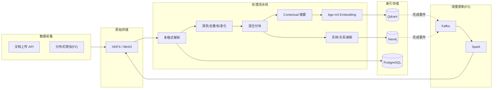
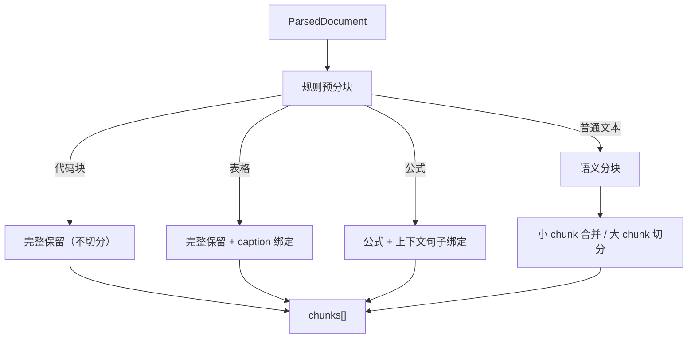

# 04 · 数据工程底座详细设计

更新时间：2026-06-02
关联：00 蓝图（§4.5 数据工程）、01 架构（§4.1 写链路 / §4.4 增量更新）、03 RAG（§3 检索 pipeline / §3.5 Contextual Retrieval）。

> 本文回答：原始数据怎么变成 Agent 可用的知识？从「上传/爬取 → 解析 → 分块 → 向量化 → 入库」全链路，加上增量更新和离线批处理。

---

## 0. 一句话定位

> 数据工程不是为了堆技术栈，而是让 Agent 拥有**可持续更新的高质量知识底座**。离线批处理保证数据质量，增量链路保证知识新鲜度，两者共同服务 03 的 RAG 检索。

---

## 1. 数据链路全景



### 分层推进策略

| 层级 | 范围 | 优先级 | 对应里程碑 |
|---|---|---|---|
| **L0** | 上传 → 解析 → 分块 → 向量化 → Qdrant + PG | P0 必达 | M3 |
| **L1** | Neo4j 图谱 + Kafka 增量 + Spark 批处理 + HDFS | P1 创新 | M4 |
| **L2** | 分布式爬虫 + 反爬 + 离线/在线索引优化 | P2 扩展 | M4+ |

---

## 2. 文档上传与多格式解析（L0）

### 2.1 支持格式

| 格式 | 解析工具 | 说明 |
|---|---|---|
| PDF | PyMuPDF (fitz) / pdfplumber | 版面分析 + 表格提取 |
| Markdown | 直接解析 | 课程笔记、技术文档 |
| DOCX | python-docx | Word 文档 |
| PPTX | python-pptx | 课件 |
| HTML | BeautifulSoup | 网页内容 |
| 代码文件 | tree-sitter / 正则 | .py / .java / .cpp 等 |
| 纯文本 | 直接读取 | — |

### 2.2 解析流程

```python
# 骨架：data_engineering/parser.py
from pydantic import BaseModel
from enum import Enum

class DocFormat(str, Enum):
    PDF = "pdf"
    MARKDOWN = "markdown"
    DOCX = "docx"
    PPTX = "pptx"
    HTML = "html"
    CODE = "code"
    TEXT = "text"

class ParsedDocument(BaseModel):
    doc_id: str
    title: str
    format: DocFormat
    sections: list[dict]       # [{heading, content, page, section_type}]
    tables: list[dict]         # [{caption, rows, page}]
    code_blocks: list[dict]    # [{language, code, context}]
    formulas: list[str]
    metadata: dict             # {author, created_at, source, ...}

class DocumentParser:
    def __init__(self):
        self.parsers = {
            DocFormat.PDF: self._parse_pdf,
            DocFormat.MARKDOWN: self._parse_markdown,
            DocFormat.DOCX: self._parse_docx,
            DocFormat.HTML: self._parse_html,
            DocFormat.CODE: self._parse_code,
        }

    async def parse(self, file_path: str, format: DocFormat) -> ParsedDocument:
        parser = self.parsers.get(format, self._parse_text)
        return await parser(file_path)

    async def _parse_pdf(self, path: str) -> ParsedDocument:
        # 1) 版面分析：识别标题/段落/表格/图片/图注
        # 2) 表格单独提取（pdfplumber）
        # 3) 公式识别（LaTeX 标记）
        # 4) 代码块识别（等宽字体区域）
        ...

    async def _parse_markdown(self, path: str) -> ParsedDocument:
        # heading 分层 + code fence + 数学公式 + 表格
        ...
```

### 2.3 元数据入 PostgreSQL

```python
# 骨架：data_engineering/metadata.py
async def save_document_metadata(db, parsed: ParsedDocument, user_id: str,
                                  tenant_id: str, course_id: str, visibility: str):
    await db.execute(
        """INSERT INTO documents (doc_id, title, format, user_id, tenant_id,
           course_id, visibility, section_count, created_at)
           VALUES ($1,$2,$3,$4,$5,$6,$7,$8,NOW())""",
        parsed.doc_id, parsed.title, parsed.format,
        user_id, tenant_id, course_id, visibility, len(parsed.sections)
    )
```

---

## 3. 混合分块策略（L0 核心）

### 3.1 为什么不用固定长度分块

固定 512 token 切分会：
- 把代码块从中间切断
- 把公式和解释分开
- 把表格拆成碎片
- 跨段落混杂不同主题

### 3.2 规则 + 语义混合分块



```python
# 骨架：data_engineering/chunker.py
from pydantic import BaseModel

class Chunk(BaseModel):
    chunk_id: str
    doc_id: str
    content: str
    chunk_type: str          # "text" | "code" | "table" | "formula"
    page: int | None
    section_heading: str
    token_count: int

class HybridChunker:
    def __init__(self, max_tokens=512, min_tokens=100, overlap_tokens=50):
        self.max_tokens = max_tokens
        self.min_tokens = min_tokens
        self.overlap = overlap_tokens

    def chunk(self, parsed: ParsedDocument) -> list[Chunk]:
        chunks = []
        for section in parsed.sections:
            section_type = section.get("section_type", "text")
            content = section["content"]

            if section_type == "code":
                # 规则：代码块完整保留，即使超长也不切分（最多按函数切）
                chunks.append(self._make_chunk(parsed.doc_id, content, "code", section))
            elif section_type == "table":
                # 规则：表格 + caption 绑定为一个 chunk
                chunks.append(self._make_chunk(parsed.doc_id, content, "table", section))
            elif section_type == "formula":
                # 规则：公式 + 前后各 1 句上下文
                chunks.append(self._make_chunk(parsed.doc_id, content, "formula", section))
            else:
                # 语义分块：按段落边界 + token 预算切分
                text_chunks = self._semantic_split(content)
                for tc in text_chunks:
                    chunks.append(self._make_chunk(parsed.doc_id, tc, "text", section))

        # 合并过小的 chunk
        chunks = self._merge_small_chunks(chunks)
        return chunks

    def _semantic_split(self, text: str) -> list[str]:
        """按段落/句子边界切分，保证每段在 [min_tokens, max_tokens] 之间。"""
        paragraphs = text.split("\n\n")
        result = []
        buffer = ""
        for p in paragraphs:
            if self._estimate_tokens(buffer + p) > self.max_tokens:
                if buffer:
                    result.append(buffer.strip())
                buffer = p
            else:
                buffer = buffer + "\n\n" + p if buffer else p
        if buffer:
            result.append(buffer.strip())
        return result

    def _merge_small_chunks(self, chunks: list[Chunk]) -> list[Chunk]:
        """将过小的相邻同类型 chunk 合并。"""
        merged = []
        for c in chunks:
            if merged and merged[-1].chunk_type == c.chunk_type \
               and merged[-1].token_count + c.token_count < self.max_tokens:
                merged[-1].content += "\n\n" + c.content
                merged[-1].token_count += c.token_count
            else:
                merged.append(c)
        return merged

    def _estimate_tokens(self, text: str) -> int:
        return len(text) // 2  # 粗估，实际用 tiktoken

    def _make_chunk(self, doc_id, content, ctype, section) -> Chunk:
        import uuid
        return Chunk(
            chunk_id=str(uuid.uuid4()),
            doc_id=doc_id,
            content=content,
            chunk_type=ctype,
            page=section.get("page"),
            section_heading=section.get("heading", ""),
            token_count=self._estimate_tokens(content)
        )
```

---

## 4. 向量化与入库（L0）

### 4.1 Embedding 流程

```python
# 骨架：data_engineering/embedder.py
class EmbeddingPipeline:
    def __init__(self, embedder, qdrant_client, llm):
        self.embedder = embedder       # bge-m3（本地）
        self.qdrant = qdrant_client
        self.llm = llm

    async def process_chunks(self, chunks: list[Chunk], doc_meta: dict,
                              acl_meta: dict):
        for chunk in chunks:
            # 1) Contextual Retrieval 增强（03 §3.5）
            enriched_content = await enrich_chunk_with_context(
                chunk.content, doc_meta.get("full_text", "")[:3000], self.llm
            )
            # 2) Embedding
            vector = await self.embedder.encode(enriched_content)

            # 3) 写入 Qdrant（带 ACL metadata）
            await self.qdrant.upsert(
                collection_name="knowledge_chunks",
                points=[{
                    "id": chunk.chunk_id,
                    "vector": vector,
                    "payload": {
                        "doc_id": chunk.doc_id,
                        "chunk_id": chunk.chunk_id,
                        "content": chunk.content,
                        "context_summary": enriched_content.split("\n\n")[0],
                        "chunk_type": chunk.chunk_type,
                        "section_heading": chunk.section_heading,
                        "page": chunk.page,
                        # ACL 元数据 —— 物理隔离的基础
                        "user_id": acl_meta["user_id"],
                        "tenant_id": acl_meta["tenant_id"],
                        "course_id": acl_meta["course_id"],
                        "visibility": acl_meta["visibility"],
                        # 排序因子
                        "source": doc_meta.get("source", "upload"),
                        "source_trust": doc_meta.get("source_trust", 0.8),
                        "published_at": doc_meta.get("published_at", ""),
                    }
                }]
            )
```

### 4.2 Qdrant Collection 配置

```python
# 骨架：data_engineering/qdrant_setup.py
from qdrant_client.models import VectorParams, Distance

COLLECTIONS = {
    "knowledge_chunks": {
        "vectors": VectorParams(size=1024, distance=Distance.COSINE),
        # bge-m3 输出 1024 维
    },
    "experience_memory": {
        "vectors": VectorParams(size=1024, distance=Distance.COSINE),
        # Mem0 底层也用 bge-m3
    },
}

# payload index（加速 ACL 过滤）
PAYLOAD_INDEXES = [
    ("knowledge_chunks", "tenant_id", "keyword"),
    ("knowledge_chunks", "visibility", "keyword"),
    ("knowledge_chunks", "course_id", "keyword"),
    ("knowledge_chunks", "user_id", "keyword"),
    ("knowledge_chunks", "source_trust", "float"),
    ("experience_memory", "task_type", "keyword"),
    ("experience_memory", "user_id", "keyword"),
]
```

---

## 5. 知识图谱构建（L1）

### 5.1 实体与关系抽取

```python
# 骨架：data_engineering/graph_builder.py
class EntityRelation(BaseModel):
    entities: list[dict]       # [{name, type, description}]
    relations: list[dict]      # [{source, target, relation_type}]

async def extract_entities_relations(chunks: list[Chunk], llm) -> EntityRelation:
    """用 LLM 从分块文本中抽取知识点实体和关系。"""
    all_entities = []
    all_relations = []
    for chunk in chunks:
        if chunk.chunk_type in ("code", "table"):
            continue  # 代码和表格不做图谱抽取
        resp = await llm.complete(
            messages=[
                {"role": "system", "content": ENTITY_EXTRACTION_PROMPT},
                {"role": "user", "content": chunk.content}
            ],
            task_type="extraction",
            schema=EntityRelation  # JSON mode 强约束
        )
        all_entities.extend(resp.entities)
        all_relations.extend(resp.relations)
    return EntityRelation(entities=dedupe_entities(all_entities),
                           relations=dedupe_relations(all_relations))

ENTITY_EXTRACTION_PROMPT = """从以下机器学习领域文本中抽取知识实体和关系。
实体类型: Concept(知识点), Skill(技能), Misconception(易错点), Algorithm(算法)
关系类型: PREREQUISITE_OF(前置依赖), RELATED_TO(相关), PART_OF(属于), TESTS(考察)
输出 JSON 格式。"""
```

### 5.2 Neo4j 写入

```python
# 骨架：data_engineering/neo4j_writer.py
async def write_to_neo4j(neo4j_driver, entities_relations: EntityRelation,
                          tenant_id: str):
    async with neo4j_driver.session() as session:
        # 写入实体
        for e in entities_relations.entities:
            await session.run(
                "MERGE (n:{type} {{name: $name, tenant_id: $tid}}) "
                "SET n.description = $desc".format(type=e["type"]),
                name=e["name"], tid=tenant_id, desc=e.get("description", "")
            )
        # 写入关系
        for r in entities_relations.relations:
            await session.run(
                "MATCH (a {{name: $src, tenant_id: $tid}}), "
                "(b {{name: $tgt, tenant_id: $tid}}) "
                "MERGE (a)-[:{rel}]->(b)".format(rel=r["relation_type"]),
                src=r["source"], tgt=r["target"], tid=tenant_id
            )
```

### 5.3 Neo4j 图模型（呼应 01 §5.3）

```text
节点:
  (:Concept {name, description, difficulty, tenant_id, visibility})
  (:Algorithm {name, description, complexity, tenant_id})
  (:Misconception {name, description, correct_understanding, tenant_id})
  (:Resource {resource_id, type, title, tenant_id})
  (:Document {doc_id, title, tenant_id})

关系:
  (Concept)-[:PREREQUISITE_OF]->(Concept)     # 前置依赖
  (Concept)-[:RELATED_TO]->(Concept)          # 相关
  (Algorithm)-[:IMPLEMENTS]->(Concept)         # 算法实现概念
  (Resource)-[:COVERS]->(Concept)             # 资源覆盖知识点
  (Misconception)-[:OF]->(Concept)            # 易错点属于某概念
  (Document)-[:CONTAINS]->(Concept)           # 文档包含概念
```

---

## 6. 数据清洗与批处理（L1 · Spark）

### 6.1 清洗任务

| 任务 | 输入 | 输出 | 工具 |
|---|---|---|---|
| 去重 | 原始文档集 | 去重后文档 | SimHash / MinHash |
| 标准化 | 各格式文本 | 统一 UTF-8 + 段落结构 | 正则 + NLP |
| 术语标准化 | 文本 | 统一专业术语（如 "SVM" / "支持向量机"） | 词典映射 |
| 质量过滤 | 文本 | 过滤过短/乱码/广告 | 规则 + 分类器 |
| 关键词抽取 | 文本 | TF-IDF / TextRank 关键词 | jieba + sklearn |

### 6.2 Spark 任务骨架

```python
# 骨架：data_engineering/spark_jobs/clean.py
from pyspark.sql import SparkSession
from pyspark.sql.functions import udf, col
from pyspark.sql.types import StringType, BooleanType

def run_cleaning_job(input_path: str, output_path: str):
    spark = SparkSession.builder.appName("knowledge-clean").getOrCreate()

    df = spark.read.json(input_path)  # HDFS 上的原始文档 JSON

    # 1) 去重（SimHash）
    simhash_udf = udf(compute_simhash, StringType())
    df = df.withColumn("simhash", simhash_udf(col("content")))
    df = df.dropDuplicates(["simhash"])

    # 2) 质量过滤
    quality_udf = udf(lambda text: len(text) > 100 and not is_garbage(text),
                       BooleanType())
    df = df.filter(quality_udf(col("content")))

    # 3) 术语标准化
    normalize_udf = udf(normalize_terms, StringType())
    df = df.withColumn("content", normalize_udf(col("content")))

    # 4) 关键词抽取
    keywords_udf = udf(extract_keywords, StringType())
    df = df.withColumn("keywords", keywords_udf(col("content")))

    df.write.mode("overwrite").json(output_path)
    spark.stop()
```

---

## 7. 增量更新链路（L1 · Kafka）

### 7.1 事件流设计

```python
# 骨架：data_engineering/events.py
class KnowledgeEvent(BaseModel):
    event_type: str       # "doc_added" | "doc_updated" | "doc_deleted"
    doc_id: str
    tenant_id: str
    timestamp: str
    payload: dict         # 变更内容

# Kafka topic 设计
TOPICS = {
    "knowledge.changes": "文档变更事件（上传/更新/删除）",
    "index.rebuild":     "索引重建任务（消费者：worker/Spark）",
}
```

### 7.2 生产者（写链路完成后发事件）

```python
# 骨架：data_engineering/producer.py
async def publish_knowledge_event(kafka_producer, event: KnowledgeEvent):
    await kafka_producer.send(
        topic="knowledge.changes",
        key=event.doc_id.encode(),
        value=event.model_dump_json().encode()
    )
```

### 7.3 消费者（增量更新索引）

```python
# 骨架：data_engineering/consumer.py
async def consume_knowledge_events(kafka_consumer, pipeline: EmbeddingPipeline,
                                    chunker: HybridChunker, parser: DocumentParser):
    async for msg in kafka_consumer:
        event = KnowledgeEvent.model_validate_json(msg.value)
        if event.event_type == "doc_added":
            # 解析 → 分块 → 向量化 → 入库
            parsed = await parser.parse(event.payload["file_path"],
                                         event.payload["format"])
            chunks = chunker.chunk(parsed)
            await pipeline.process_chunks(chunks, event.payload, event.payload["acl"])
            # 失效相关 Redis 缓存
            await invalidate_cache(event.tenant_id)
        elif event.event_type == "doc_updated":
            # 删旧 chunk → 重新入库
            await delete_doc_chunks(event.doc_id)
            # ... 同 doc_added
        elif event.event_type == "doc_deleted":
            await delete_doc_chunks(event.doc_id)
```

---

## 8. 分布式爬虫（L2 · P2 扩展）

### 8.1 架构

```text
调度器 (Celery Beat)
  → 爬虫 Worker 池 (Celery Workers)
    → 目标网站（公开课程资料、教程、文档）
      → 原始数据 → HDFS
      → 解析后 → 写链路（§2-4）
```

### 8.2 反爬策略

| 策略 | 实现 |
|---|---|
| 重试 | 指数退避 + 最大重试次数 |
| Cookie 池 | Redis 维护多 cookie，轮换使用 |
| User-Agent 轮换 | 随机选取 UA 列表 |
| 代理池 | 可选，接入免费/付费代理 |
| 请求限速 | 每域名 QPS 限制（信号量） |
| 滑块验证 | playwright + 滑块识别（极端情况） |

```python
# 骨架：data_engineering/crawler/base.py
class CrawlerConfig(BaseModel):
    max_retries: int = 3
    retry_backoff: float = 2.0        # 指数退避基数
    qps_limit: float = 1.0            # 每域名每秒请求数
    cookie_pool_key: str = "crawler:cookies:{domain}"
    ua_rotate: bool = True

class BaseCrawler:
    def __init__(self, config: CrawlerConfig, redis_client):
        self.config = config
        self.redis = redis_client

    async def fetch(self, url: str) -> str:
        for attempt in range(self.config.max_retries):
            try:
                cookie = await self._get_cookie(url)
                ua = self._random_ua() if self.config.ua_rotate else None
                resp = await self._request(url, cookie=cookie, ua=ua)
                if resp.status == 200:
                    return resp.text
                if resp.status == 429:  # 限流
                    await asyncio.sleep(self.config.retry_backoff ** attempt)
            except Exception:
                await asyncio.sleep(self.config.retry_backoff ** attempt)
        raise CrawlerError(f"Failed after {self.config.max_retries} retries: {url}")
```

---

## 9. 端到端写链路 API

```python
# 骨架：api/routes/knowledge.py
@router.post("/api/knowledge/upload")
async def upload_document(
    file: UploadFile,
    course_id: str,
    visibility: str = "course",
    user: User = Depends(get_current_user)
):
    # 1) 保存原始文件到 HDFS / 本地
    raw_path = await save_raw_file(file, user.tenant_id)

    # 2) 解析
    parsed = await parser.parse(raw_path, detect_format(file.filename))

    # 3) 元数据入 PG
    await save_document_metadata(db, parsed, user.id, user.tenant_id,
                                  course_id, visibility)

    # 4) 分块
    chunks = chunker.chunk(parsed)

    # 5) 向量化 + 入 Qdrant
    acl_meta = {"user_id": user.id, "tenant_id": user.tenant_id,
                "course_id": course_id, "visibility": visibility}
    await embedding_pipeline.process_chunks(chunks, parsed.metadata, acl_meta)

    # 6) 图谱抽取 + 入 Neo4j
    er = await extract_entities_relations(chunks, llm)
    await write_to_neo4j(neo4j, er, user.tenant_id)

    # 7) 发布 Kafka 事件
    await publish_knowledge_event(kafka, KnowledgeEvent(
        event_type="doc_added", doc_id=parsed.doc_id,
        tenant_id=user.tenant_id, timestamp=now(),
        payload={"file_path": raw_path, "format": parsed.format, "acl": acl_meta}
    ))

    return {"doc_id": parsed.doc_id, "chunks": len(chunks),
            "entities": len(er.entities), "relations": len(er.relations)}
```

---

## 10. 与其他文档的衔接

| 文档 | 本文为其提供 | 它为本文提供 |
|---|---|---|
| 03 记忆与 RAG | Qdrant 数据入库、ACL metadata、chunk 结构 | Contextual Retrieval 要求、检索 pipeline 需求 |
| 02 Agent 编排 | 知识底座（Agent 的知识来源） | retrieve Skill 的 IO 契约 |
| 05 网关与工具 | — | LLMGateway（Contextual 摘要/实体抽取用） |
| 07 工程化 | docker-compose 中 HDFS/Spark/Kafka 配置需求 | 目录结构规范 |
