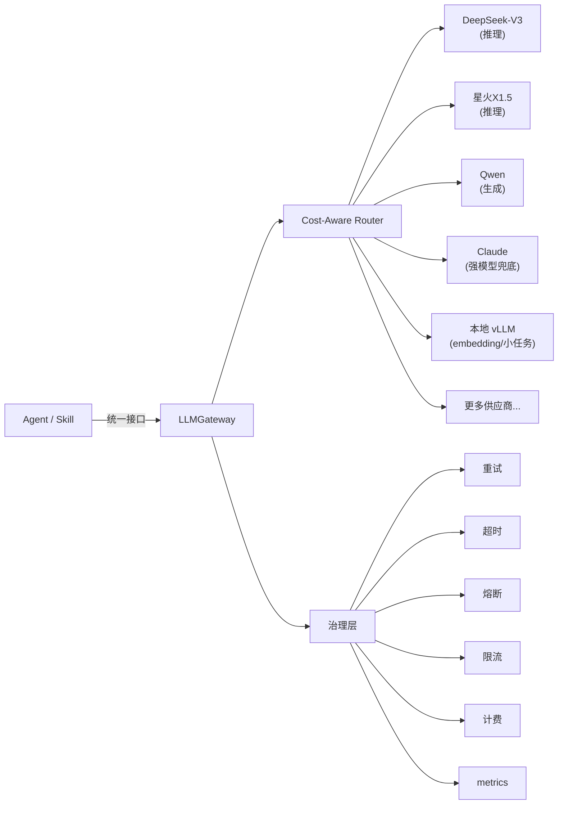

# 05 · LLM 网关与 MCP 工具详细设计

更新时间：2026-06-02
关联：00 蓝图（§4.3 LLM / §4.6 执行）、01 架构（§7 接口契约）、02 编排（§4 Skill / §9 接口）。

> 本文回答：模型怎么调（LLM 网关多供应商路由 + 回退）、工具怎么管（MCP 标准化 + Skill 暴露）、任务怎么并发（taskExecutor 三层并发）。三条正交的扩展轴互不耦合。

---

## 0. 一句话定位

> 换模型不影响工具，加工具不影响模型，并发策略不影响业务逻辑。三者通过统一接口解耦，是系统可扩展性的工程保障。

---

## 1. LLM 网关（LLMGateway）

### 1.1 为什么需要网关

直接在业务代码里 `import openai` 会导致：
1. 供应商绑定，切换成本高。
2. 限流/超时/计费散落各处，无法统一治理。
3. 无法做 cost-aware 路由（便宜任务用贵模型浪费钱）。

### 1.2 架构：LiteLLM 为核心



### 1.3 核心接口

```python
# 骨架：llm_gateway/gateway.py
from pydantic import BaseModel
from typing import AsyncIterator
from enum import Enum

class TaskType(str, Enum):
    REASONING = "reasoning"         # 复杂推理（规划/诊断）
    GENERATION = "generation"       # 内容生成（文档/题目）
    EXTRACTION = "extraction"       # 结构化抽取（画像/实体）
    SUMMARY = "summary"             # 摘要/压缩
    JUDGMENT = "judgment"           # 质量判断/打分
    EMBEDDING = "embedding"         # 向量化
    CHEAP = "cheap"                 # 简单分类/路由

class Completion(BaseModel):
    text: str
    model_used: str
    input_tokens: int
    output_tokens: int
    cost_usd: float
    latency_ms: int

class LLMGateway:
    def __init__(self, config: GatewayConfig):
        self.router = CostAwareRouter(config.routing_rules)
        self.fallback_chain = config.fallback_chains
        self.circuit_breakers = {}
        self.rate_limiters = {}
        self.billing = BillingTracker()

    async def complete(self, messages: list[dict], *,
                       task_type: TaskType,
                       schema: type[BaseModel] | None = None,
                       temperature: float | None = None,
                       stream: bool = False) -> Completion | AsyncIterator[str]:
        # 1) 路由选择模型
        model = self.router.select(task_type)

        # 2) 回退链执行
        for provider in self._get_chain(model):
            if self._is_circuit_open(provider):
                continue
            if not self._check_rate_limit(provider):
                continue
            try:
                result = await self._call_provider(
                    provider, messages, schema=schema,
                    temperature=temperature, stream=stream
                )
                self.billing.record(provider, result)
                return result
            except (TimeoutError, RateLimitError, ProviderError) as e:
                self._record_failure(provider, e)
                continue

        raise AllProvidersFailedError("所有供应商均不可用")

    async def _call_provider(self, provider, messages, **kwargs):
        """统一调用接口，内部用 LiteLLM 适配各供应商。"""
        import litellm
        resp = await litellm.acompletion(
            model=provider.model_id,
            messages=messages,
            api_key=provider.api_key,
            api_base=provider.api_base,
            timeout=provider.timeout,
            temperature=kwargs.get("temperature", 0.7),
            response_format=kwargs.get("schema"),
            stream=kwargs.get("stream", False),
        )
        return self._parse_response(resp, provider)
```

### 1.4 Cost-Aware 路由规则

```python
# 骨架：llm_gateway/router.py
class RoutingRule(BaseModel):
    task_type: TaskType
    primary: str                  # 首选模型
    fallbacks: list[str]          # 回退链
    max_cost_per_call: float      # 单次成本上限

DEFAULT_ROUTING = {
    TaskType.REASONING:   RoutingRule(task_type=TaskType.REASONING,
                                      primary="deepseek-v3",
                                      fallbacks=["spark-x1.5", "claude-sonnet"],
                                      max_cost_per_call=0.05),
    TaskType.GENERATION:  RoutingRule(task_type=TaskType.GENERATION,
                                      primary="qwen-plus",
                                      fallbacks=["spark-lite", "deepseek-v3"],
                                      max_cost_per_call=0.03),
    TaskType.EXTRACTION:  RoutingRule(task_type=TaskType.EXTRACTION,
                                      primary="qwen-turbo",
                                      fallbacks=["deepseek-v3"],
                                      max_cost_per_call=0.01),
    TaskType.SUMMARY:     RoutingRule(task_type=TaskType.SUMMARY,
                                      primary="qwen-turbo",
                                      fallbacks=["spark-lite"],
                                      max_cost_per_call=0.01),
    TaskType.JUDGMENT:    RoutingRule(task_type=TaskType.JUDGMENT,
                                      primary="deepseek-v3",
                                      fallbacks=["claude-sonnet"],
                                      max_cost_per_call=0.03),
    TaskType.EMBEDDING:   RoutingRule(task_type=TaskType.EMBEDDING,
                                      primary="local-bge-m3",
                                      fallbacks=[],
                                      max_cost_per_call=0.0),
    TaskType.CHEAP:       RoutingRule(task_type=TaskType.CHEAP,
                                      primary="qwen-turbo",
                                      fallbacks=["spark-lite"],
                                      max_cost_per_call=0.005),
}

class CostAwareRouter:
    def __init__(self, rules: dict[TaskType, RoutingRule]):
        self.rules = rules

    def select(self, task_type: TaskType) -> str:
        rule = self.rules.get(task_type, self.rules[TaskType.GENERATION])
        return rule.primary

    def get_fallback_chain(self, task_type: TaskType) -> list[str]:
        rule = self.rules[task_type]
        return [rule.primary] + rule.fallbacks
```

### 1.5 HTTP 回退链 + 熔断

```python
# 骨架：llm_gateway/resilience.py
import time

class CircuitBreaker:
    def __init__(self, failure_threshold=3, recovery_timeout=60):
        self.failure_threshold = failure_threshold
        self.recovery_timeout = recovery_timeout
        self.failures = 0
        self.last_failure_time = 0
        self.state = "closed"  # closed | open | half-open

    def record_failure(self):
        self.failures += 1
        self.last_failure_time = time.time()
        if self.failures >= self.failure_threshold:
            self.state = "open"

    def record_success(self):
        self.failures = 0
        self.state = "closed"

    def is_open(self) -> bool:
        if self.state == "open":
            if time.time() - self.last_failure_time > self.recovery_timeout:
                self.state = "half-open"
                return False
            return True
        return False
```

### 1.6 计费追踪

```python
# 骨架：llm_gateway/billing.py
class BillingTracker:
    """按供应商和任务类型累计 token 和成本，写入 PG + Prometheus。"""

    async def record(self, provider, completion: Completion):
        # 1) 写 PG（持久化）
        await self.db.execute(
            "INSERT INTO llm_billing (provider, model, task_type, input_tokens, "
            "output_tokens, cost_usd, latency_ms, created_at) "
            "VALUES ($1,$2,$3,$4,$5,$6,$7,NOW())",
            provider.name, completion.model_used, provider.task_type,
            completion.input_tokens, completion.output_tokens,
            completion.cost_usd, completion.latency_ms
        )
        # 2) Prometheus metrics
        llm_cost_total.labels(provider=provider.name).inc(completion.cost_usd)
        llm_latency.labels(provider=provider.name).observe(completion.latency_ms)
        llm_tokens_total.labels(provider=provider.name, direction="input").inc(completion.input_tokens)
        llm_tokens_total.labels(provider=provider.name, direction="output").inc(completion.output_tokens)
```

---

## 2. MCP 工具层

### 2.1 为什么要 MCP 化

把工具硬编码在 Agent 代码里的问题：
1. 新增工具要改 Agent 逻辑。
2. 工具描述散落各处，不可发现。
3. 权限/限次/监控无统一管理。

MCP（Model Context Protocol）提供标准化的工具发现、参数校验、权限边界。

### 2.2 MCPToolRegistry

```python
# 骨架：mcp_tools/registry.py
from pydantic import BaseModel

class ToolSpec(BaseModel):
    name: str
    description: str
    input_schema: dict         # JSON Schema
    output_schema: dict
    category: str              # "retrieval" | "generation" | "validation" | "utility"
    risk_level: str            # "low" | "medium" | "high"
    requires_confirmation: bool  # 高风险工具需要人工确认

class ToolResult(BaseModel):
    ok: bool
    data: dict | None
    error: str | None
    duration_ms: int

class MCPToolRegistry:
    def __init__(self):
        self._tools: dict[str, ToolSpec] = {}
        self._handlers: dict[str, callable] = {}

    def register(self, spec: ToolSpec, handler: callable):
        self._tools[spec.name] = spec
        self._handlers[spec.name] = handler

    def list_tools(self, category: str | None = None) -> list[ToolSpec]:
        if category:
            return [t for t in self._tools.values() if t.category == category]
        return list(self._tools.values())

    async def call(self, tool: str, params: dict, ctx: dict) -> ToolResult:
        spec = self._tools.get(tool)
        if not spec:
            return ToolResult(ok=False, data=None, error=f"Unknown tool: {tool}",
                              duration_ms=0)
        # 1) 参数校验（JSON Schema）
        if not validate_params(params, spec.input_schema):
            return ToolResult(ok=False, data=None,
                              error=f"Invalid params for {tool}", duration_ms=0)
        # 2) 高风险确认检查
        if spec.requires_confirmation and not ctx.get("user_confirmed"):
            return ToolResult(ok=False, data=None,
                              error="REQUIRES_CONFIRMATION", duration_ms=0)
        # 3) 执行
        import time
        start = time.time()
        try:
            result = await self._handlers[tool](params, ctx)
            duration = int((time.time() - start) * 1000)
            return ToolResult(ok=True, data=result, error=None, duration_ms=duration)
        except Exception as e:
            duration = int((time.time() - start) * 1000)
            return ToolResult(ok=False, data=None, error=str(e), duration_ms=duration)
```

### 2.3 Skill → MCP 暴露

02 中定义的每个 Skill 都通过 MCP 注册为标准工具：

```python
# 骨架：mcp_tools/skill_adapter.py
def register_skill_as_tool(registry: MCPToolRegistry, skill: Skill):
    """把 02 的 Skill 自动注册为 MCP Tool。"""
    spec = ToolSpec(
        name=skill.name,
        description=skill.__doc__ or skill.name,
        input_schema=skill.input_model.model_json_schema(),
        output_schema=skill.output_model.model_json_schema(),
        category=infer_category(skill.name),
        risk_level="low",
        requires_confirmation=False
    )
    async def handler(params, ctx):
        inp = skill.input_model(**params)
        skill_ctx = SkillContext(**ctx)
        result = await skill.run(inp, skill_ctx)
        return result.data
    registry.register(spec, handler)

# 启动时批量注册
def register_all_skills(registry, skills: list[Skill]):
    for skill in skills:
        register_skill_as_tool(registry, skill)
```

### 2.4 工具渐进披露（节省 Token）

不把所有工具描述一次性塞给 LLM，而是按需加载：

```python
# 骨架：mcp_tools/progressive.py
class ProgressiveToolLoader:
    def __init__(self, registry: MCPToolRegistry):
        self.registry = registry

    def get_tools_for_context(self, task_type: str,
                               current_step: str) -> list[ToolSpec]:
        """根据当前任务类型和步骤，只返回相关的工具子集。"""
        relevance_map = {
            "planning": ["retrieve", "graph_query", "path_plan"],
            "generating": ["doc_gen", "quiz_gen", "mindmap_gen",
                           "code_gen", "video_gen", "retrieve"],
            "verifying": ["quality_check", "retrieve"],
            "routing": ["retrieve", "graph_query"],
        }
        relevant_names = relevance_map.get(current_step, [])
        return [t for t in self.registry.list_tools()
                if t.name in relevant_names]
```

---

## 3. taskExecutor 分层并发

### 3.1 三层并发模型

| 层级 | 特征 | 并发策略 | 实现 |
|---|---|---|---|
| **编排层** | 任务 DAG，有依赖 | 串行 / 拓扑序（LangGraph 控制） | LangGraph `Send` + 条件边 |
| **子任务层** | 多资源生成，相互独立 | 并行扇出，汇聚到 gate | `asyncio.gather` / LangGraph map-reduce |
| **工具调用层** | IO 密集（检索/API） | 高并发 + 信号量限流 | `asyncio.Semaphore` |
| **重任务层** | 耗时（视频生成/批处理） | 异步队列 | Celery + Redis |

### 3.2 taskExecutor 实现

```python
# 骨架：executor/task_executor.py
import asyncio
from pydantic import BaseModel

class TaskConfig(BaseModel):
    max_concurrent_skills: int = 5     # Skill 层并发上限
    max_concurrent_llm: int = 3        # LLM 调用并发上限
    skill_timeout: int = 30            # 单个 Skill 超时（秒）
    llm_timeout: int = 60              # 单个 LLM 调用超时

class TaskExecutor:
    def __init__(self, config: TaskConfig):
        self.config = config
        self.skill_sem = asyncio.Semaphore(config.max_concurrent_skills)
        self.llm_sem = asyncio.Semaphore(config.max_concurrent_llm)

    async def run_skill(self, skill: Skill, inp, ctx) -> SkillResult:
        """受信号量控制的 Skill 执行。"""
        async with self.skill_sem:
            try:
                return await asyncio.wait_for(
                    skill.run(inp, ctx),
                    timeout=self.config.skill_timeout
                )
            except asyncio.TimeoutError:
                return SkillResult(ok=False, data=None,
                                   error_type="timeout", duration_ms=self.config.skill_timeout * 1000)

    async def run_llm(self, gateway: LLMGateway, messages, **kwargs) -> Completion:
        """受信号量控制的 LLM 调用。"""
        async with self.llm_sem:
            return await asyncio.wait_for(
                gateway.complete(messages, **kwargs),
                timeout=self.config.llm_timeout
            )

    async def run_parallel_skills(self, tasks: list[tuple]) -> list[SkillResult]:
        """并行执行多个 Skill，汇聚结果。"""
        coros = [self.run_skill(skill, inp, ctx) for skill, inp, ctx in tasks]
        return await asyncio.gather(*coros, return_exceptions=True)

    async def run_async_task(self, task_fn, *args, **kwargs):
        """耗时任务提交到 Celery。"""
        from celery_app import celery
        result = celery.send_task(task_fn, args=args, kwargs=kwargs)
        return result.id  # 返回任务 ID，前端通过 SSE 轮询状态
```

### 3.3 Celery 异步任务（重任务）

```python
# 骨架：executor/celery_tasks.py
from celery_app import celery

@celery.task(bind=True, max_retries=2, soft_time_limit=300)
def generate_video_task(self, script: str, config: dict) -> dict:
    """视频生成（耗时 30s-5min），走 Celery 异步。"""
    try:
        result = call_seedance_api(script, config)
        return {"ok": True, "video_url": result["url"]}
    except Exception as e:
        self.retry(exc=e, countdown=30)

@celery.task(bind=True, max_retries=1, soft_time_limit=600)
def batch_embedding_task(self, chunks: list, acl_meta: dict) -> dict:
    """批量向量化（大文档上传时）。"""
    pipeline = get_embedding_pipeline()
    results = pipeline.process_chunks_sync(chunks, acl_meta)
    return {"ok": True, "count": len(results)}
```

---

## 4. 流式输出（SSE）

### 4.1 事件类型

```python
# 骨架：api/sse.py
from enum import Enum

class SSEEventType(str, Enum):
    TOKEN = "token"                    # LLM 生成的 token
    RESOURCE_CARD = "resource_card"    # 资源卡片完成
    AGENT_STEP = "agent_step"         # Agent 执行步骤（可视化用）
    PROGRESS = "progress"             # 任务进度
    ERROR = "error"                   # 错误
    DONE = "done"                     # 完成

class SSEEvent(BaseModel):
    event: SSEEventType
    data: dict

async def stream_session(orchestrator, user_id, message, acl):
    """将 Orchestrator 的事件流转为 SSE。"""
    async for event in orchestrator.run_session(user_id, message, acl):
        yield f"event: {event.type}\ndata: {event.model_dump_json()}\n\n"
```

### 4.2 FastAPI SSE 端点

```python
# 骨架：api/routes/chat.py
from fastapi import APIRouter
from fastapi.responses import StreamingResponse

@router.post("/api/chat")
async def chat(req: ChatRequest, user: User = Depends(get_current_user)):
    acl = ACLScope(user_id=user.id, tenant_id=user.tenant_id,
                   course_ids=req.course_ids, visibility=["public", "course", "private"])
    return StreamingResponse(
        stream_session(orchestrator, user.id, req.message, acl),
        media_type="text/event-stream",
        headers={"Cache-Control": "no-cache", "X-Accel-Buffering": "no"}
    )
```

---

## 5. 供应商配置（YAML）

```yaml
# config/llm_providers.yaml
providers:
  deepseek-v3:
    model_id: "deepseek-chat"
    api_base: "https://api.deepseek.com/v1"
    api_key_env: "DEEPSEEK_API_KEY"
    timeout: 60
    max_retries: 2
    cost_per_1k_input: 0.001
    cost_per_1k_output: 0.002

  spark-x1.5:
    model_id: "spark-x1.5"
    api_base: "https://spark-api.xf-yun.com/v1"
    api_key_env: "SPARK_API_KEY"
    timeout: 45
    max_retries: 2
    cost_per_1k_input: 0.002
    cost_per_1k_output: 0.004

  qwen-plus:
    model_id: "qwen-plus"
    api_base: "https://dashscope.aliyuncs.com/compatible-mode/v1"
    api_key_env: "QWEN_API_KEY"
    timeout: 60
    max_retries: 2
    cost_per_1k_input: 0.0008
    cost_per_1k_output: 0.002

  claude-sonnet:
    model_id: "claude-sonnet-4-6"
    api_base: "https://api.anthropic.com/v1"
    api_key_env: "ANTHROPIC_API_KEY"
    timeout: 90
    max_retries: 1
    cost_per_1k_input: 0.003
    cost_per_1k_output: 0.015

  local-bge-m3:
    model_id: "bge-m3"
    api_base: "http://localhost:8001/v1"
    timeout: 10
    max_retries: 0
    cost_per_1k_input: 0.0
    cost_per_1k_output: 0.0

routing:
  reasoning: [deepseek-v3, spark-x1.5, claude-sonnet]
  generation: [qwen-plus, spark-lite, deepseek-v3]
  extraction: [qwen-turbo, deepseek-v3]
  summary: [qwen-turbo, spark-lite]
  judgment: [deepseek-v3, claude-sonnet]
  embedding: [local-bge-m3]
  cheap: [qwen-turbo, spark-lite]
```

---

## 6. 与其他文档的衔接

| 文档 | 本文为其提供 | 它为本文提供 |
|---|---|---|
| 02 Agent 编排 | LLMGateway.complete / MCPToolRegistry.call / TaskExecutor | Skill 基类、Agent 调用工具的方式 |
| 03 记忆与 RAG | LLMGateway（摘要/rerank 用） | RAGService 接口（retrieve Skill 通过 MCP 暴露） |
| 04 数据工程 | LLMGateway（Contextual 摘要/实体抽取用） | 批量 embedding 任务定义 |
| 06 评测 | 计费数据、latency metrics | 评测脚本需要调用 LLMGateway |
| 07 工程化 | docker-compose 中 llm-gateway / vllm 配置 | 配置管理规范 |
