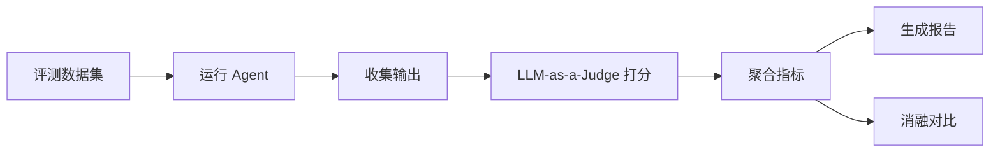

# 06 · 评测与可观测详细设计

更新时间：2026-06-02
关联：00 蓝图（§4.7 评测与可观测）、02 编排（trace_id 贯穿）、03 RAG（重复错误下降率）、05 网关（计费/延迟 metrics）。

> 本文回答：怎么知道系统好不好（评测）、怎么知道系统在干什么（可观测）。评测是拿分的核心论据——没有量化数据，创新性无法被证明。

---

## 0. 一句话定位

> 评测不是事后补的报告，而是从 M1 开始就搭好的自动化 harness——每次改动跑一遍，用数字说话。可观测不是堆 dashboard，而是让每一次 Agent 调用链路可追溯、可归因。

---

## 1. 评测体系总览

### 1.1 四层评测

| 层 | 评什么 | 方法 | 数据来源 | 对应指标 |
|---|---|---|---|---|
| **检索层** | RAG 召回质量 | 标注集 + 自动指标 | knowledge_chunks + 标注 query-doc pairs | Recall@k, MRR, Hit Rate |
| **生成层** | 资源内容质量 | LLM-as-a-judge | 生成的 resources | 正确性、画像匹配度、格式完整性 (0-1) |
| **Agent 层** | 端到端任务完成 | 场景测试集 | 预定义学习目标 → 期望输出 | 任务完成率、工具调用成功率 |
| **系统层** | 性能与成本 | 自动采集 | Prometheus metrics | 延迟 P50/P95、token 成本、缓存命中率 |

### 1.2 消融对比（核心创新论据）

| 对比维度 | 实验组 | 控制组 | 证明什么 |
|---|---|---|---|
| 单 Agent vs 多 Agent | 完整系统 | 去掉 Planner/Router，单 Generator 直接生成 | 多 Agent 协作的价值 |
| 有/无 Reflexion | 完整系统 | 去掉 Critic + 经验 recall | 失败学习的价值 |
| 有/无 Rerank | 完整 RAG | 去掉 bge-reranker | Rerank 对检索精度的影响 |
| 混合检索 vs 纯语义 | Qdrant + Neo4j + BM25 | 仅 Qdrant | 混合检索的价值 |
| PaE vs 纯 ReAct | PaE 宏观 + ReAct 微观 | 全部用 ReAct | 混合推理范式的价值 |
| 有/无 Contextual Retrieval | 带上下文摘要的 chunk | 原始 chunk | Contextual Retrieval 的价值 |

---

## 2. LLM-as-a-Judge 评测框架

### 2.1 为什么用 LLM 打分

- 人工标注成本高、不可持续。
- 传统 NLP 指标（BLEU/ROUGE）对生成质量评价不准。
- LLM judge 与人类评分相关性已被验证（见 Anthropic/OpenAI 论文）。

### 2.2 评测维度与 prompt

```python
# 骨架：eval/judge.py
from pydantic import BaseModel, Field

class JudgeScore(BaseModel):
    correctness: float = Field(ge=0, le=1, description="知识准确性")
    profile_match: float = Field(ge=0, le=1, description="是否匹配学习者画像难度/风格")
    completeness: float = Field(ge=0, le=1, description="内容完整性")
    format_quality: float = Field(ge=0, le=1, description="格式规范性")
    overall: float = Field(ge=0, le=1, description="综合评分")
    reasoning: str = Field(description="评分理由")

JUDGE_PROMPT = """你是一个教育资源质量评审专家。请评估以下学习资源的质量。

学习者画像:
{profile}

学习目标:
{goal}

资源类型: {resource_type}
资源内容:
{content}

参考知识（来自知识库检索）:
{reference}

请从以下维度打分（0-1）：
1. correctness: 知识是否准确，是否与参考知识一致
2. profile_match: 难度和风格是否匹配学习者画像
3. completeness: 内容是否完整覆盖目标知识点
4. format_quality: 格式是否规范（标题/结构/代码高亮等）
5. overall: 综合评分

输出 JSON 格式。"""

class LLMJudge:
    def __init__(self, llm_gateway):
        self.llm = llm_gateway

    async def evaluate(self, resource: dict, profile: dict,
                       goal: str, reference: str) -> JudgeScore:
        prompt = JUDGE_PROMPT.format(
            profile=str(profile), goal=goal,
            resource_type=resource["type"],
            content=resource["content"][:3000],
            reference=reference[:2000]
        )
        resp = await self.llm.complete(
            messages=[{"role": "user", "content": prompt}],
            task_type="judgment",
            schema=JudgeScore,
            temperature=0  # judge 用低温
        )
        return resp
```

### 2.3 评测数据集格式

```python
# 骨架：eval/dataset.py
class EvalCase(BaseModel):
    case_id: str
    goal: str                          # 学习目标
    profile: dict                      # 模拟的学习者画像
    expected_resource_types: list[str]  # 期望生成的资源类型
    reference_concepts: list[str]      # 应覆盖的知识点
    difficulty_range: tuple[float, float]  # 期望难度范围
    tags: list[str]                    # 用于分组分析

# 示例
EVAL_CASES = [
    EvalCase(
        case_id="ml-001",
        goal="学习线性回归的原理和实现",
        profile={"knowledge_base": {"statistics": 0.6, "python": 0.8},
                 "cognitive_style": "active", "weak_points": ["数学推导"]},
        expected_resource_types=["doc", "code", "quiz"],
        reference_concepts=["线性回归", "最小二乘法", "梯度下降"],
        difficulty_range=(0.3, 0.6),
        tags=["supervised_learning", "basic"]
    ),
    # ...更多 case
]
```

---

## 3. 自动评测脚本

### 3.1 评测 Pipeline



### 3.2 评测脚本骨架

```python
# 骨架：eval/run_eval.py
import asyncio
import json

class EvalRunner:
    def __init__(self, orchestrator, judge: LLMJudge, rag_service):
        self.orchestrator = orchestrator
        self.judge = judge
        self.rag = rag_service

    async def run_eval(self, cases: list[EvalCase],
                       strategy_name: str = "full") -> EvalReport:
        results = []
        for case in cases:
            # 1) 运行 Agent 系统
            output = await self._run_case(case)

            # 2) 检索参考知识（用于 judge 对比）
            reference = await self.rag.retrieve(
                case.goal, acl=ACLScope(user_id="eval", tenant_id="eval",
                                        course_ids=[], visibility=["public"]),
                strategy=RetrievalStrategy(use_semantic=True, top_k=5)
            )
            ref_text = "\n".join(c.content for c in reference.chunks)

            # 3) 对每个生成的资源打分
            scores = []
            for resource in output.get("resources", []):
                score = await self.judge.evaluate(
                    resource=resource, profile=case.profile,
                    goal=case.goal, reference=ref_text
                )
                scores.append(score)

            # 4) 收集系统指标
            metrics = self._collect_metrics(output)

            results.append(EvalResult(
                case_id=case.case_id,
                strategy=strategy_name,
                scores=scores,
                task_completed=output.get("completed", False),
                resource_types_generated=[r["type"] for r in output.get("resources", [])],
                metrics=metrics
            ))

        return self._aggregate(results, strategy_name)

    async def _run_case(self, case: EvalCase) -> dict:
        events = []
        async for event in self.orchestrator.run_session(
            user_id="eval", message=case.goal,
            acl=ACLScope(user_id="eval", tenant_id="eval",
                          course_ids=[], visibility=["public"])
        ):
            events.append(event)
        return self._parse_events(events)

    def _aggregate(self, results: list, strategy: str) -> EvalReport:
        return EvalReport(
            strategy=strategy,
            total_cases=len(results),
            task_completion_rate=sum(1 for r in results if r.task_completed) / len(results),
            avg_correctness=avg([s.correctness for r in results for s in r.scores]),
            avg_profile_match=avg([s.profile_match for r in results for s in r.scores]),
            avg_completeness=avg([s.completeness for r in results for s in r.scores]),
            avg_overall=avg([s.overall for r in results for s in r.scores]),
            resource_coverage=self._calc_coverage(results),
            metrics_summary=self._summarize_metrics(results)
        )
```

### 3.3 消融对比脚本

```python
# 骨架：eval/ablation.py
async def run_ablation(cases: list[EvalCase]):
    configs = {
        "full": {"multi_agent": True, "reflexion": True, "rerank": True,
                 "hybrid_retrieval": True, "pae": True},
        "no_reflexion": {"multi_agent": True, "reflexion": False, "rerank": True,
                          "hybrid_retrieval": True, "pae": True},
        "single_agent": {"multi_agent": False, "reflexion": False, "rerank": True,
                          "hybrid_retrieval": True, "pae": False},
        "no_rerank": {"multi_agent": True, "reflexion": True, "rerank": False,
                       "hybrid_retrieval": True, "pae": True},
        "semantic_only": {"multi_agent": True, "reflexion": True, "rerank": True,
                           "hybrid_retrieval": False, "pae": True},
        "react_only": {"multi_agent": True, "reflexion": True, "rerank": True,
                        "hybrid_retrieval": True, "pae": False},
    }

    reports = {}
    for name, config in configs.items():
        orchestrator = build_orchestrator(config)
        judge = LLMJudge(llm_gateway)
        runner = EvalRunner(orchestrator, judge, rag_service)
        reports[name] = await runner.run_eval(cases, strategy_name=name)

    # 生成对比表
    comparison = generate_comparison_table(reports)
    save_report(comparison, "eval_results/ablation_report.json")
    return comparison
```

### 3.4 报告输出格式

```python
class EvalReport(BaseModel):
    strategy: str
    total_cases: int
    task_completion_rate: float
    avg_correctness: float
    avg_profile_match: float
    avg_completeness: float
    avg_overall: float
    resource_coverage: dict[str, float]  # {type: coverage_rate}
    metrics_summary: dict                # {avg_latency, p95_latency, total_cost, ...}

class AblationComparison(BaseModel):
    strategies: list[str]
    metrics: dict[str, dict[str, float]]  # {metric: {strategy: value}}
    winner: str
    analysis: str
```

---

## 4. RAG 专项评测

### 4.1 检索质量指标

```python
# 骨架：eval/rag_eval.py
class RAGEvalResult(BaseModel):
    recall_at_5: float
    recall_at_10: float
    mrr: float                  # Mean Reciprocal Rank
    hit_rate: float             # 是否命中至少一个相关文档
    avg_relevance_score: float  # reranker 平均得分
    conflict_detection_rate: float
    acl_leak_count: int         # ACL 泄露次数（应为 0）

async def eval_rag(rag_service: RAGService, test_set: list[dict]) -> RAGEvalResult:
    """test_set: [{query, relevant_chunk_ids, acl}]"""
    recalls_5, recalls_10, mrrs, hits = [], [], [], []
    for item in test_set:
        result = await rag_service.retrieve(
            item["query"], acl=item["acl"],
            strategy=RetrievalStrategy(use_semantic=True, use_graph=True, top_k=10)
        )
        retrieved_ids = [c.chunk_id for c in result.chunks]
        relevant = set(item["relevant_chunk_ids"])

        # Recall@k
        recalls_5.append(len(relevant & set(retrieved_ids[:5])) / len(relevant))
        recalls_10.append(len(relevant & set(retrieved_ids[:10])) / len(relevant))

        # MRR
        for rank, rid in enumerate(retrieved_ids, 1):
            if rid in relevant:
                mrrs.append(1.0 / rank)
                break
        else:
            mrrs.append(0.0)

        # Hit Rate
        hits.append(1.0 if relevant & set(retrieved_ids) else 0.0)

    return RAGEvalResult(
        recall_at_5=avg(recalls_5),
        recall_at_10=avg(recalls_10),
        mrr=avg(mrrs),
        hit_rate=avg(hits),
        avg_relevance_score=0.0,  # 从实际检索结果汇总
        conflict_detection_rate=0.0,
        acl_leak_count=0
    )
```

### 4.2 Reflexion 效果评测

```python
# 骨架：eval/reflexion_eval.py
async def eval_reflexion_effect(orchestrator, cases: list[EvalCase]) -> dict:
    """连续运行同类任务两轮，度量第二轮错误率是否下降。"""
    # 第一轮：无经验积累
    first_round = await run_cases(orchestrator, cases)
    first_failure_rate = count_failures(first_round) / len(cases)

    # 第二轮：带 Reflexion 经验
    second_round = await run_cases(orchestrator, cases)
    second_failure_rate = count_failures(second_round) / len(cases)

    improvement = (first_failure_rate - second_failure_rate) / max(first_failure_rate, 0.01)
    return {
        "first_round_failure_rate": first_failure_rate,
        "second_round_failure_rate": second_failure_rate,
        "improvement_rate": improvement,
        "reflexion_effective": improvement > 0.1  # 改善超 10% 视为有效
    }
```

---

## 5. 可观测体系

### 5.1 三支柱

| 支柱 | 工具 | 用途 |
|---|---|---|
| **Traces** | LangSmith / OpenTelemetry | 单次请求全链路追踪：每个 Agent 节点 + Skill 调用 + LLM 调用 |
| **Metrics** | Prometheus + Grafana | 聚合指标：延迟、吞吐、错误率、成本、缓存命中 |
| **Logs** | 结构化日志 (JSON) | 调试 + 审计 |

### 5.2 Trace 贯穿

```python
# 骨架：observability/tracing.py
import uuid

class TraceContext:
    def __init__(self, session_id: str):
        self.trace_id = str(uuid.uuid4())
        self.session_id = session_id
        self.spans: list[dict] = []

    def start_span(self, name: str, metadata: dict = None) -> str:
        span_id = str(uuid.uuid4())
        self.spans.append({
            "span_id": span_id,
            "name": name,
            "start_time": time.time(),
            "end_time": None,
            "metadata": metadata or {},
            "status": "running"
        })
        return span_id

    def end_span(self, span_id: str, status: str = "ok", result: dict = None):
        for span in self.spans:
            if span["span_id"] == span_id:
                span["end_time"] = time.time()
                span["status"] = status
                span["result"] = result
                span["duration_ms"] = int((span["end_time"] - span["start_time"]) * 1000)
                break

    def to_dict(self) -> dict:
        return {
            "trace_id": self.trace_id,
            "session_id": self.session_id,
            "spans": self.spans,
            "total_duration_ms": sum(s.get("duration_ms", 0) for s in self.spans)
        }
```

### 5.3 Prometheus Metrics 定义

```python
# 骨架：observability/metrics.py
from prometheus_client import Counter, Histogram, Gauge

# Agent 层
agent_task_total = Counter("agent_task_total", "Total agent tasks", ["agent", "status"])
agent_task_duration = Histogram("agent_task_duration_seconds", "Agent task duration",
                                 ["agent"], buckets=[1, 5, 10, 30, 60, 120])
agent_replan_total = Counter("agent_replan_total", "Replan count")
agent_iteration_total = Counter("agent_iteration_total", "Total iterations")

# Skill 层
skill_call_total = Counter("skill_call_total", "Skill calls", ["skill", "status"])
skill_call_duration = Histogram("skill_call_duration_seconds", "Skill call duration",
                                 ["skill"], buckets=[0.1, 0.5, 1, 5, 10, 30])
skill_cache_hit = Counter("skill_cache_hit_total", "Skill cache hits", ["skill"])

# RAG 层
rag_retrieval_total = Counter("rag_retrieval_total", "RAG retrievals", ["strategy"])
rag_retrieval_duration = Histogram("rag_retrieval_duration_seconds", "RAG latency",
                                    buckets=[0.1, 0.5, 1, 2, 5])
rag_cache_hit = Counter("rag_cache_hit_total", "RAG cache hits")
rag_conflict_detected = Counter("rag_conflict_detected_total", "Conflicts detected")

# LLM 层（05 已定义，这里汇总引用）
llm_cost_total = Counter("llm_cost_usd_total", "LLM cost in USD", ["provider"])
llm_latency = Histogram("llm_latency_ms", "LLM call latency", ["provider"],
                          buckets=[100, 500, 1000, 3000, 5000, 10000])
llm_tokens_total = Counter("llm_tokens_total", "Total tokens", ["provider", "direction"])
llm_fallback_total = Counter("llm_fallback_total", "Fallback triggered", ["from_provider", "to_provider"])

# 系统层
active_sessions = Gauge("active_sessions", "Currently active sessions")
```

### 5.4 Grafana Dashboard 设计

| Panel | 指标 | 告警条件 |
|---|---|---|
| **Agent 完成率** | agent_task_total{status="success"} / total | < 80% |
| **P95 响应延迟** | histogram_quantile(0.95, agent_task_duration) | > 30s |
| **Replan 频率** | rate(agent_replan_total) | > 0.5/min |
| **LLM 成本/小时** | rate(llm_cost_usd_total) | > $5/h |
| **回退触发率** | rate(llm_fallback_total) | > 10% |
| **RAG 缓存命中** | rate(rag_cache_hit) / rate(rag_retrieval_total) | < 30% |
| **Skill 错误率** | rate(skill_call_total{status="error"}) | > 5% |
| **活跃会话数** | active_sessions | > 50 |

### 5.5 Agent 协作可视化（赛题加分项）

前端 `/agents` 页面展示的数据来源：

```python
# 骨架：observability/agent_timeline.py
class AgentTimelineEvent(BaseModel):
    timestamp: float
    agent: str
    action: str           # "start" | "tool_call" | "decision" | "fail" | "pass" | "replan"
    detail: str
    duration_ms: int | None
    children: list[dict]  # Skill 调用细节

def build_timeline(trace: TraceContext) -> list[AgentTimelineEvent]:
    """从 trace spans 构建前端可渲染的时间线数据。"""
    events = []
    for span in trace.spans:
        events.append(AgentTimelineEvent(
            timestamp=span["start_time"],
            agent=span["name"],
            action=span["metadata"].get("action", "execute"),
            detail=str(span.get("result", "")),
            duration_ms=span.get("duration_ms"),
            children=span["metadata"].get("sub_calls", [])
        ))
    return sorted(events, key=lambda e: e.timestamp)
```

---

## 6. 评测结果入库

```python
# 骨架：eval/persistence.py
async def save_eval_run(db, report: EvalReport):
    await db.execute(
        """INSERT INTO eval_runs (strategy, total_cases, completion_rate,
           avg_correctness, avg_profile_match, avg_overall, metrics_json, created_at)
           VALUES ($1,$2,$3,$4,$5,$6,$7,NOW())""",
        report.strategy, report.total_cases, report.task_completion_rate,
        report.avg_correctness, report.avg_profile_match, report.avg_overall,
        json.dumps(report.metrics_summary)
    )
```

---

## 7. 与其他文档的衔接

| 文档 | 本文为其提供 | 它为本文提供 |
|---|---|---|
| 02 Agent 编排 | trace_id 在 SkillContext 中贯穿 | AgentState 的 iteration/token_used 做指标来源 |
| 03 记忆与 RAG | 重复错误下降率指标定义 + RAG 评测 | RAGService 接口 |
| 05 网关 | LLM 层 metrics 定义 | 计费/延迟数据 |
| 07 工程化 | Prometheus + Grafana docker-compose 配置 | 目录结构 |
